# 6장. RAG 에이전트

# 6장 | RAG와 에이전트

## 0. 각 질의에 적절한 컨텍스트를 구성하는 방법

1. RAG
    - 모델이 외부 데이터 소스에서 관련 정보를 검색할 수 있게함
    - 컨텍스트를 구성하는 데 사용
2. Agent
    - 모델이 웹 검색이나 뉴스 API 같은 도구를 사용해 정보를 수집할 수 있게함
    - 외부 도구 활용을 통해 컨텍스트 구성 이상의 기능을 수행(웹 검색, 시각화 등)

## 1. RAG

- 외부 메모리 소스(내부 DB, 채팅 세션, 인터넷)에서 관련 정보를 검색하여 모델의 성능을 향상시키는 기술
- 검색 후 생성(Retrieve-then-generate) 패턴
    - 질의와 가장 관련성이 높은 5개의 위키피디아 페이지 검색 → 모델이 페이지를 읽어 응답 생성
        
        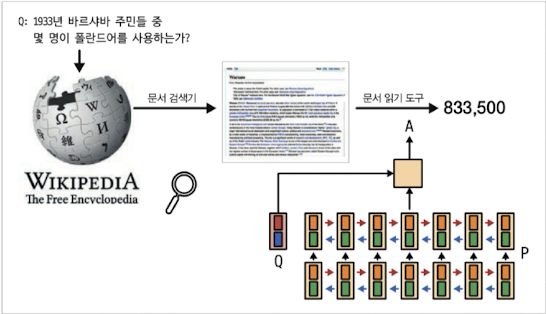
        
- 검색 증강 생성
    - 가용한 지식 전부를 모델에 직접 입력하기 어려운 지식 집약적 작업을 해결하기 위한 방법
        
        → 관련 정보(주어진 질의와 가장 관련성이 높다고 판단한 정보)에 접근할 수 있으면 모델이 더 자세한 응답을 생성하는 동시에 환각을 줄이는 데 도움이 됨
        
    - ex) 사용자 데이터 관리: 특정 사용자에 관한 질의가 들어올 때만 해당 사용자의 데이터를 컨텍스트에 포함하면 된다.
    - 파운데이션 모델의 컨텍스트 구성 = 전통적인 ML 모델의 특성 공학
- RAG의 필요성
    - 초기: 컨텍스트 제한을 극복 → 긴 컨텍스트로 RAG의 필요성을 없앨 수 있지 않을까?
    - 더 긴 컨텍스트가 필요한 애플리케이션의 필요성
        - 사용 가능한 데이터의 양은 시간이 지나면서 계속 증가
        - 다양한 애플리케이션에서 데이터가 증가하는 속도를 따라잡기에는 아직 부족
    - 컨텍스트 길이와 컨텍스트 활용 효율성
        - 롱 컨텍스트를 처리할 수 있는 모델이 반드시 그 컨텍스트를 잘 활용하는 것은 아니다
        - 컨텍스트가 길수록 모델이 컨텍스트의 잘못된 부분에 집중할 가능성이 높아짐
            
            → RAG는 질의가 가장 관련성이 높은 정보만 사용하게 해서 입력 토큰 수를 줄이면서도(비용, 시간) 모델의 성능을 향상시킬 수 있다.
            
            cf) 앤트로픽 조언: 지식 베이스가 200,000 토큰(약 500p) 미만이라면 전체 지식 베이스를 프롬프트에 그냥 포함시켜도 된다고 조언
            

### 6.1.1 RAG 아키텍처

- 구성: 검색기(외부 메모리 소스에서 정보를 검색), 생성 모델(검색된 정보를 기반으로 응답을 생성하는 생성 모델)
- 구현 방식
    - 초기: 검색기와 생성 모델을 함께 학습(초기 RAG 논문)
    https://arxiv.org/abs/2005.11401
    - 현재: 검색기와 생성 모델을 따로 학습, 만들어진 검색기와 생성 모델을 활용
        
        But, RAG 시스템 전체를 처음부터 끝까지 파인튜닝하면 성능이 훨씬 좋아질 수 있다.
        
- 검색기의 품질
    - 색인화(Indexing)
        - 빠르게 검색할 수 있도록 데이터를 처리하는 작업, 검색 방식에 따라 색인화 방식도 달라짐
    - 질의(Query)
        - 관련 데이터를 검색하기 위해 시스템에 요청을 전송하는 과정

<aside>

cf) 청크: 문서를 관리하기 쉽게 분할한 단위, 책에서 문서와 청크를 모두 문서로 부름

</aside>

### 6.1.2 검색 알고리즘

- 검색(Retrieval)
    - 검색 엔진, 추천 시스템, 로그 분석의 근간
    - 일반적으로 하나의 DB, 시스템에 국한
- 서치(Search)
    - 다양한 시스템에 걸친 검색을 포함

→ 책에서는 두 용어를 구분 없이 사용

- **검색의 방식**
    - 주어진 질의에 대한 문서들의 관련성을 기준으로 순위를 매기는 방식
    - **용어 기반 검색**
        - Sparse Retriever: 희소 벡터(대부분의 값이 0인 벡터)를 사용하여 데이터를 표현
        - 키워드를 사용하는 가장 간단한 방법(어휘적 검색)
        - 문제점:
            - 예상보다 많은 문서에서 질의에서 찾는 용어가 포함될 수 있다.(컨텍스트 초과 이슈 발생 가능) → 더 자주 나오는 용어만 선택(TF; 용어 빈도수 고려)
            - 질의가 길고, 포함되는 다양한 용어 중에 중요도를 나타낼 수 없다 → 많은 문서에 흔하게 등장하는 용어일수록 유용하지 않을 수 있다(IDF; 역문서 빈도)
        - 해결책:
            - TF-IDF(용어 빈도와 역문서 빈도를 결합한 알고리즘)
            - 엘라스틱서치: 용어를 문서로 매핑하는 역색인 데이터 구조를 활용하여 관련 문서를 빠르게 찾음
                
                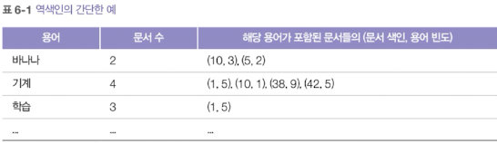
                
            - BM25: TF-IDF를 개선한 점수 계산 방식(문서 길이도 추가로 고려하여 용어 빈도 점수를 정규화한다) → 긴 문서일수록 특정 용어를 포함할 가능성이 높고, 용어 빈도 값도 자연히 높아짐
        - 토큰화(질의를 개별 용어로 나누는 과정)
            - 간단한 방법: 질의를 여러 단어로 나누어 각각을 별도의 용어로 취급하는 것
                
                → 여러 단어로 이루어진 용어가 개별 단어로 분리되면서 본래의 의미가 사라질 수 있다
                ex) 핫도그 → 핫 + 도그 (원래 용어의 의미를 담지 못함, n-gram으로 해결 가능 = n-gram으로 문서 검색 가능)
                
                → 불용어 제거: 소문자 변환, 구두점 제거, 불용어 제거 → NLTK, spaCy, CoreNLP 같은 전통적인 NLP 패키지 활용
                
        - 장단점 요약
            - (+) 색인화와 질의 모두에서 임베딩 기반 검색보다 빠른 속도
                - 용어 추출 >> 임베딩 생성, 문서 매핑 >> 최근접 이웃 검색
            - (+) 비교적 간단한 구동(별도의 설정 없어도 된다. But, 조정할 수 있는 요소가 적다고 생각할 수도 있음)
            
    - **임베딩 기반 검색**
        - Dense Retriever: 밀집 벡터(대부분의 값이 0이 아닌 벡터)를 사용해 표현
        - 원본 데이터 청크를 임베딩으로 변환하여 **벡터 데이터베이스**에 저장
            
            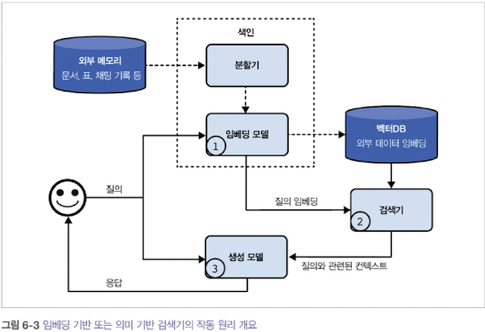
            
            - 임베딩 모델: 색인화에 사용된 것과 동일한 임베딩 모델을 사용해 질의를 임베딩으로 변환
            - 검색기: 질의 임베딩과 가장 가까운 k개의 데이터 청크를 가져온다. (k는 hyper parameter)
            - 그림에서 보이는 것 외에 리랭커(검색된 후보들의 순위를 다시 매김), 캐시(지연 시간을 줄이기 위해 저장) 등의 구성 요소들도 포함될 수 있다.
        - 벡터 검색
            - 질의 벡터와 유사한 벡터들을 Vector DB에서 찾아내야 한다.
                
                → 벡터들이 빠르고 효율적인 검색이 가능한 방식으로 색인화 및 저장되어야 함
                
            - 보통 최근접 이웃 검색 문제로 접근
            
            <aside>
            
            <가장 기본적인 방식: k-NN 알고리즘>
            
            1. 질의 임베딩과 Vector DB의 모든 벡터 간의 유사도 점수를 코사인 유사도와 같은 지표를 사용해 계산한다.
            2. 모든 벡터를 유사도 점수에 따라 순위를 매긴다.
            3. 높은 유사도 점수를 가진 상위 k개의 벡터를 반환한다
            </aside>
            
            → 결과는 정확하지만 계산이 많고 느리다(작은 데이터셋에만 적용 가능)
            
            <aside>
            
            <근사 최근접 이웃: ANN 알고리즘>
            
            1. **사전 색인화(인덱스 구축)**: Vector DB는 저장된 벡터들을 ANN 인덱스(예: HNSW 그래프, IVF 클러스터 등)로 구성해 빠르게 탐색할 수 있는 구조를 만든다.
            2. **후보 탐색(근사 검색)**: 질의 임베딩이 들어오면 인덱스를 따라가며 “가까울 가능성이 높은” 벡터 후보 집합을 빠르게 수집한다(전체를 다 보지 않음,,,).
            3. **후보 재정렬(정확 점수 계산)**: 모은 후보들에 대해서만 코사인 유사도 같은 지표로 점수를 계산해 순위를 매긴다.
            4. **Top-k 반환**: 재정렬 결과에서 상위 k개의 벡터를 반환한다.
            </aside>
            
            - 대표적인 검색 알고리즘
                - 지역 민감 해싱(LSH: Locally sensitive hashing)
                - 계층적 탐색이 가능한 소규모 세계(HNSW: hierarchical navigable small world)
                - 제품 양자화(Product quantization)
                - 역파일 색인(IVF: Inverted file index)
                - 근사 최근접 이웃 탐색(Annoy: Approximate nearest neighbors oh yeah)
                - 공간 분할 트리 및 그래프(SPTAG: Space partition tree and graph)
                - 근사 최근접 이웃을 위한 빠른 라이브러리(FLANN: Fast library for approximate nearest neighbors)
        - 장단점 요약
            - (+) 용어 기반 검색보다 더 좋은 성능
            - (-) 데이터를 임베딩으로 변환하면 용어가 희석되어 나중에 검색하기 어려워질 수 있음 → Sol. 용어 기반 검색과 임베딩 기반 검색의 결합으로 해결

- 검색기의 품질 측정 방법
    - 지표
        - 컨텍스트 정밀도
            - 검색된 모든 문서 중에서 실제로 질의와 관련된 문서의 비율은 얼마인가?
        - 컨텍스트 재현율(컨텍스트 관련성)
            - 질의와 관련된 모든 문서 중에서 검색된 문서의 비율은 얼마인가?
        - (의미 기반 검색의 경우, ) 임베딩 품질
            - 비슷한 문서들이 벡터 공간에 가깝게 위치하면 좋은 품질
            - 특정 작업에서 효과적이면 특정 작업에 좋은 품질(ex: MTEB 벤치마크)
    - 지표 계산 방법
        - 테스트용 질의 목록 + 질의에 해당하는 문서 집합으로 평가 세트 구성
        - 각 테스트 질의에 대해 테스트 문서가 관련 있는지 없는지 주석을 단다(사람 or AI)
        - 평가 세트에서 검색기의 정밀도 및 재현율 계산
        
        cf) RAG 프레임워크가 재현율은 지원하지 않는 경우가 많다(질의와 관련된 모든 문서를 알 수 없기 때문; 코퍼스 전수 조사 및 샘플링 어렵기 때문)
        
        - 검색된 문서의 순위가 중요한 경우 다음 지표를 활용할 수 있다
            - 정규화된 할인 누적 이득(NDCG)
            - 평균 정밀도(MAP)
            - 평균 역순위(MRR)

- RAG 시스템 컨텍스트에서의 검색기 품질 평가
    - 속도, 성능, 비용 측면에서 본 용어 기반 검색과 의미 기반 검색 비교
    
    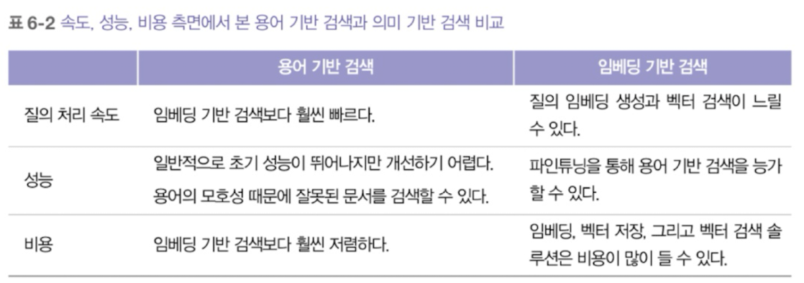
    
    → 색인화와 질의 사이의 적절한 균형이 중요함
        (색인화가 상세할수록 검색 과정은 더 정확, 속도는 더 느려짐)
    

<aside>

RAG 시스템의 품질은 구성 요소와 전체 시스템 모두에서 평가해야 한다.

1. 검색 품질 평가
2. 최종 RAG 출력 결과 평가
3. 임베딩 품질 평가
</aside>

- **하이브리드 검색(검색 알고리즘 결합: 용어 기반 검색 + 임베딩 기반 검색)**
    
    **1) 하이브리드 검색의 2가지 대표 패턴**
    
    - **A**. 병렬(Parallel) 하이브리드 + 퓨전(Fusion)
        
        A-1) 점수 기반 퓨전(가중합 / “비율” 방식)
        
        - 개념: 두 검색기가 만든 점수를 정규화한 뒤 가중합
        - 예시:
            - `final = α * norm(BM25_score) + (1-α) * norm(vector_score)`
        - 장점
            - 직관적(α로 “BM25 vs Dense 비중” 조절)
            - 튜닝하면 특정 도메인에서 잘 맞음
        - 주의점(매우 중요)
            - **스코어 스케일이 다름**(BM25 vs cosine/inner product) → **정규화 없으면 α가 의미 없어짐**
            - 실무에서 이 이유로 “점수 기반”보다 “순위 기반”을 더 선호하는 경우 많음
        
        A-2) 순위 기반 퓨전(Rank Fusion)
        
        - 개념: 점수 대신 **랭킹(등수)** 만 이용해 합친다
        - 대표: **RRF(Reciprocal Rank Fusion)**
            - 여러 랭킹에서 상위에 자주 등장하는 문서를 우대
        - 장점
            - 점수 스케일 문제를 피함
            - 구현/운영이 비교적 안정적
        - 단점
            - “비율(α)”처럼 정밀한 조절은 상대적으로 어려움(파라미터는 있지만 직관성이 덜함)
    - B. 계단식(Cascade, 2-stage) 하이브리드
        
        비용이 싼 검색기로 **후보군을 넓게 생성**하고, 다음 단계에서 **더 비싸고 정확한 방식으로 재정렬/필터링**한다.
        
        - 대표 구조 예시
            - 1단계(cheap): BM25로 top-1000 후보 생성
            - 2단계(mid): 후보에 대해 dense similarity로 top-200 재정렬**[Reranking의 과정!!!]**
            - 3단계(expensive): **reranker**로 top-20 최종 정렬
        - 장점
            - 대규모 코퍼스에서 비용/지연시간을 통제하기 좋음
            - 상위 단계로 갈수록 “정확도”를 끌어올리는 설계가 쉬움
        - 단점
            - 파이프라인이 길어지고 복잡해짐(관측/튜닝 포인트 증가)
    
    cf) 리랭커(Reranker) : 리랭커는 “쿼리-문서”를 더 정밀하게 비교해 **관련도 점수로 재정렬**하는 모듈
    
    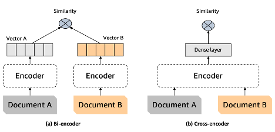
    
    (1) Cross-Encoder 리랭커 (가장 대표)
    (2) Bi-Encoder / Late-Interaction 계열(리랭커로도 쓰임)
    (3) LLM 기반 리랭커
    (4) 규칙/학습 기반 랭킹(LTR) 리랭커
    

### 6.1.3 검색 최적화

- 청킹 전략
    
    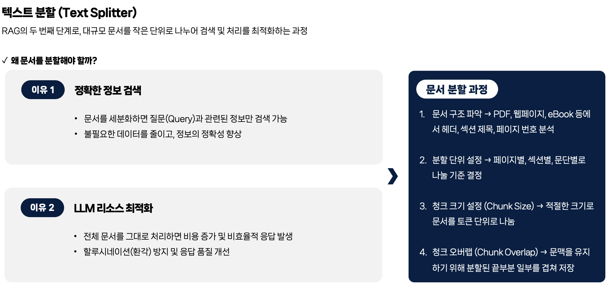
    
    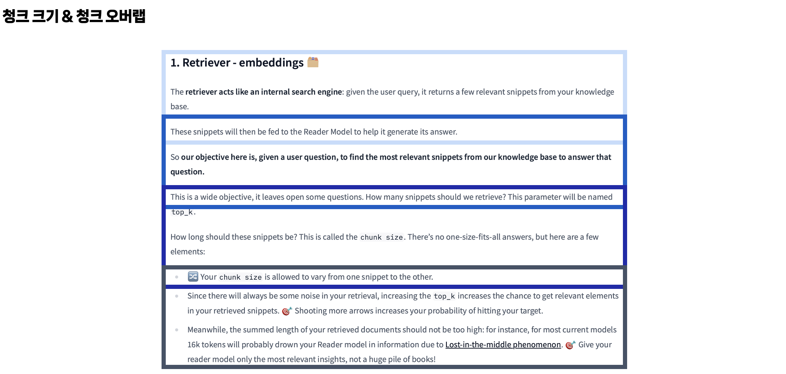
    
    - 동일한 길의의 청크로 나누기
    - 재귀적 분할(여러 절 → 여러 단락 → 문장: 내용이 중간에 끊길 가능성이 줄어듦)
    - 토큰 길이 기준으로 나누기
    
    → 적절한 청크 크기는 실험을 통해 찾아야 한다.
    
- 재순위화
    - 초기에 검색한 문서의 순위를 재순위화 한다. (모델 컨텍스트에 맞추거나 입력 토큰 줄일 수 있음)
        
        ex) 
        최신 문서에 높은 가중치를 매기는 재순위, 
        컨텍스트 재순위화(원래 검색 순위: `1, 2, 3, 4, 5` → 컨텍스트 재순위화 후: `1, 3, 5, 4, 2`)
        

- 질의 재작성(질의 재구성, 질의 정규화, 질의 확장)
    - 새롭게 작성한 질의는 별도의 컨텍스트 없이 의미가 명확하게 전달되어야 한다.
- 컨텍스트 검색
    - 각 청크에 컨텍스트를 추가해 필요한 청크를 더 쉽게 검색할 수 있게 함
    
    ex) 태그, 키워드 등의 메타데이터, 응답할 수 있는 질의, 원본 문서의 제목, 요약
    
    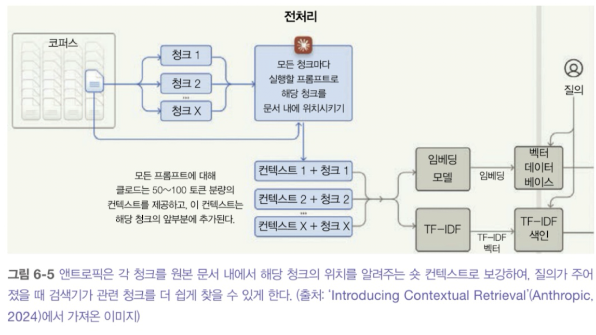
    
- 검색 솔루션 평가하기
    
    <aside>
    
    1. 어떤 검색 방식을 지원하는가?, 하이브리드 검색을 지원하는가?
    2. 벡터 DB라면, 어떤 임베딩 모델과 벡터 검색 알고리즘을 지원하는가?
    3. 데이터 저장량과 트래픽 측면에서 얼마나 확장 가능한가? 트래픽 패턴에 적합한가?
    4. 데이터 색인화하는 데 얼마나 시간이 걸리는가? 한 번에 얼마나 많은 데이터를 대량으로 처리(추가/삭제 등)할 수 있는가?
    5. 다양한 검색 알고리즘에 대한 질의 지연 시간은 어느 정도인가?
    6. 관리형 솔루션 인경우, 가격 체계는 어떻게 되는가? 저장된 문서/벡터 양에 따라 가격이 책정되는지, 아니면 검색 요청 횟수에 따라 책정되는가?
    </aside>
    

### **6.1.4 텍스트를 넘어선 RAG**

1. **멀티모달 RAG(이미지, 비디오, 오디오)**

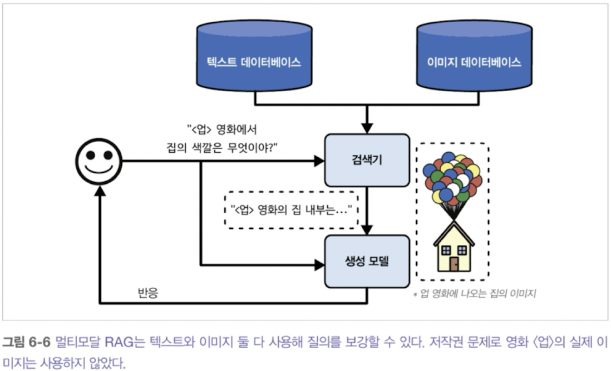

- 텍스트 기반: 메타 데이터(제목, 태그, 캡션)를 활용하여 검색
- 이미지 기반: 멀티모달 임베딩 모델을 활용하여 벡터 검색

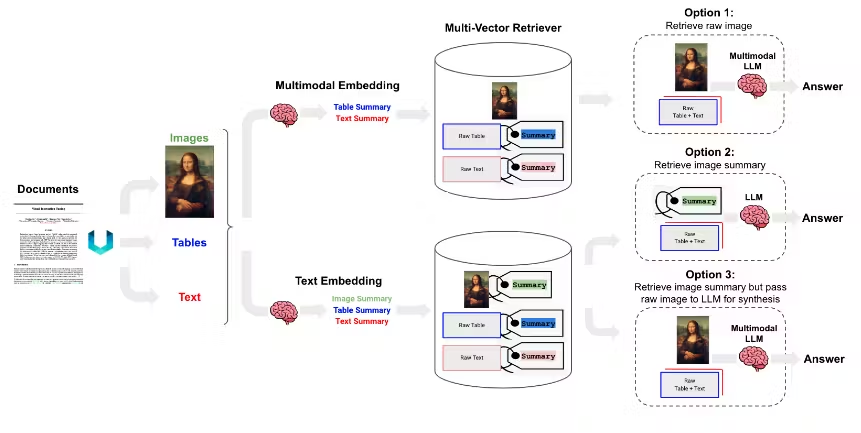

https://blog.langchain.com/semi-structured-multi-modal-rag/

- **Option 1 (멀티모달 임베딩 기반)**: CLIP 같은 멀티모달 임베딩으로 **이미지·텍스트를 같은 벡터 공간에 임베딩**해 유사도 검색하고, docstore에 연결된 **원본 이미지/텍스트를 멀티모달 LLM에 넣어 답변을 생성**한다.
- **Option 2 (이미지→텍스트 요약 후 텍스트 검색, 이미지 제외)**: 멀티모달 LLM으로 **이미지를 텍스트 요약으로 변환**한 뒤, 그 요약을 **텍스트 임베딩으로 검색**하고, 답변 생성 단계에서는 원본 텍스트와 이미지 요약을 활용한다.
- **Option 3 (이미지→텍스트 요약 후 검색 + 원본 이미지 사용)**: 멀티모달 LLM으로 만든 **이미지 요약을 임베딩 및 검색에 활용.** 검색 결과는 **원본 이미지와 연결**해 두고, 최종 답변 생성 시에는 **원본 이미지+텍스트를 멀티모달 LLM에 넣어 합성**한다

1. **표 형식 데이터를 활용한 RAG**
- 일반적인 표 형식 데이터 보강하기 위해서 (가져오기 위해서) DB의 경우 Text-to-SQL을 사용한다.
- 일반적인 문서에서 가져올 경우,
    - **VLM/멀티모달 기반:** PaddleOCR 등
    - **문서 파싱+구조화(레이아웃/OCR/테이블 추출) 기반**: Unstructured, Camelot 등
        
        [https://github.com/docling-project/docling](https://github.com/docling-project/docling)
        

## 6.2 에이전트

- 지능형 에이전트: AI의 궁극적인 목표로 여기는 것, 파운데이션 모델의 획귀적인 능력 덕분에 에이전트 기반 애플리케이션의 문이 열림, 신생 분야라 정의, 개발, 평가, 평가를 위한 이론적 프레임워크가 존재하지 않음
    
    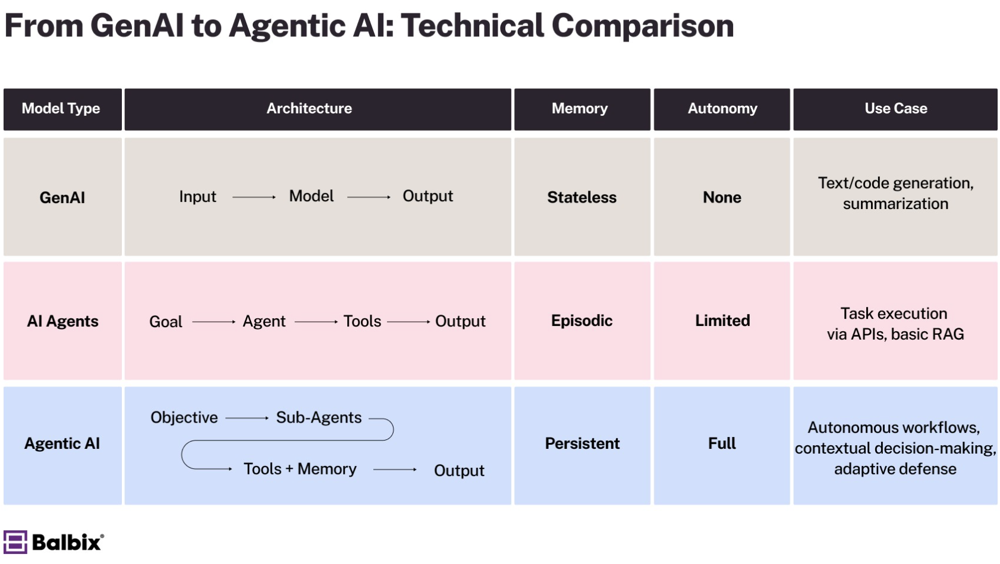
    

### 6.2.1 에이전트 개요

- 에이전트: 자신의 환경을 인식하고 그 환경에서 행동할 수 있는 모든 것(작동하는 환경과 수행할 수 있는 행동들로 정의됨), 수행할 수 있는 행동 집합들은 접근할 수 있는 도구에 의해 확장됨
    
    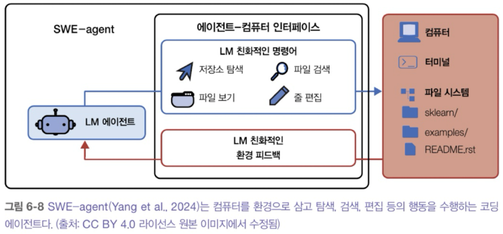
    
- 에이전트의 환경과 도구들 사이에는 강한 의존성이 있다. (환경은 에이전트가 잠재적으로 사용할 수 있는 도구를 결정)

- 에이전트가 강력한 모델이 필요한 이유
    - 누적되는 오류: 애이전트는 보통 작업을 수행하기 위해 여러 단계를 거쳐햐 하는데, 단계가 증가할 수록 전체 정확도는 감소한다.(일종의 노이즈의 누적)
    - 더 큰 위험성: 도구를 사용할 수 있게 되면서 에이전트가 실패할 경우, 더 심각한 결과를 초래할 수 잇다.

### 6.2.2 도구

- 도구: 에이전트에게 환경을 인식하는 능력(읽기)과 그 환경에 변화를 주는 능력(쓰기)
    
    ex) DB 검색 tool: 데이터 읽기와 데이터 쓰기(입력, 삭제, 갱신)
    
- 대표적인 도구 예시
    - 지식 증강
        - 에이전트의 지식을 증강해주는 도구
        - ex) 텍스트 검색 tool, 이미지 검색 tool, SQL 실행 tool, 재고 상태 확인 tool, 슬랙 tool, 이메일 tool, 웹 검색 tool
    - 능력 확장
        - AI 모델의 고유한 한계를 보완하는 도구
        - ex) 계산기 tool, 캘린더 tool, 코드 인터프리터 tool, 모델(ex: 텍스트-이미지 변환 모델) tool
    - 쓰기 행동
        - 읽는 것 외에 데이터 소스를 변경하는 쓰기 행동을 수행하는 도구
        - ex) SQL 실행 tool, 이메일 작성 tool
- **도구 사용은 단순한 프롬프팅이나 심지어 파인튜닝보다 모델의 성능을 크게 향상시킬 수 있다.**

### 6.2.3 계획 수립

- Agent의 핵심은 (**`목표`와 제약 조건으로 정의된** **작업**)을 해결하는 모델이 자리잡고 있다.
ex) 5,000달러 예산으로 샌프란시스코에서 인도까지 `2주 여행`을 계획하는 작업

- **계획 수립**
    - 작업을 달성하는 데 필요한 단계를 정리한 로드맵
    - 복잡한 작업 수행에서 필수적이며, 모델이 작업을 수행하기 위한 이해, 선택지 고려, 최선의 선택시 선택 등의 과정을 포함한다.
    - 효율적으로 하기 위해선 **계획 수립**과 **실행**을 분리해야 한다.(계획을 만들고, 검증된 후에만 실행)
        
        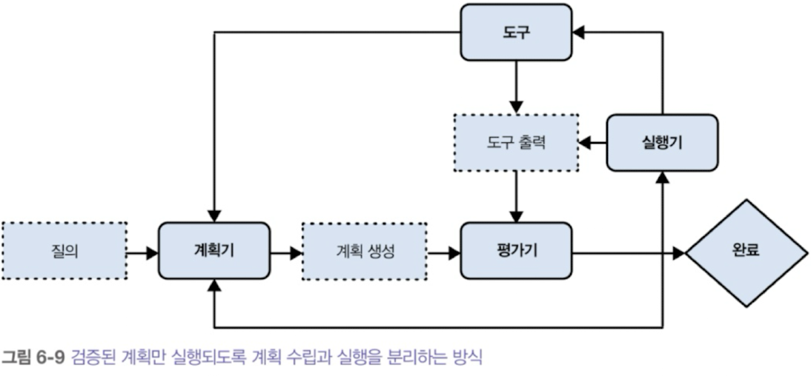
        
    - 구성 요소
        - 계획을 생성하는 요소
        - 계획을 검증하는 요소
        - 계획을 실행하는 요소
    
    cf) 계획을 병렬적으로 동시에 여러개 만들고 최적의 계획을 선택하도록 요청할 수 있다.
    

- 일반적인 작업(목표 + 제약 조건) 수행의 과정
    1. 계획 생성: 작업 수행을 위한 계획을 세운다. 계획은 관리 가능한 일련의 행동들로 구성되므로 작업 분해라고도 한다.
    2. 성찰(Reflection)과 오류 수정: 생성된 계획을 평가하고, 좋지 않다면 새로운 계획을 생성한다
    3. 실행: 생성된 계획에 따라 행동을 수행한다(주로 특정 함수를 호출하는 방식: function calling)
    4. 성찰과 오류 수정: 행동 결과를 평가하고 목표 달성 여부를 확인한다(오류가 있다면 수정하고 없으면 새로운 계획을 세운다)

- 계획자 역할을 하는 파운데이션 모델(근데 이제, LLM이 계획 수립에 취약한 이유)
    - 자기회귀 LLM은 계획을 세울 수 없다고 보는 경우가 많다.
        
        → 계획 수립은 본질적으로 백트래팅이 포함된 탐색 문제임에 반해, 자기회귀 모델은 앞으로 나아가는 행동만 생성할 수 있다.(But, A 행동 경로 수행하고, 적절하지 않으면 B 경로로 수정할 수 있는데 이를 백트래킹으로 볼 수 있지 않을까?)
        
    - 계획에 필요한 도구를 제대로 갖추지 못함
        - 그 결과 상태를 알지 못하고 단순히 모델에게 행동 순서만 생성하도록 하면 제대로된 계획을 세울 수 없다. (일종의 시뮬레이터가 필요하다는 것)
    
    → 그럼에도, LLM을 계획 수립 시스템의 일보루 활용할 수 있다.(검색 도구, 상태 추적 시스템을 결합하여 강화할 수 잇다)
    

- **계획 생성**
    - 프롬프트 엔지니어링으로 계획 생성을 할 수 있지만, 환각의 위험성이 존재한다
        
        → 더 많은 예시가 포함된 시스템 프롬프트를 작성
        
        → 사용가능한 도구와 파라미터에 대해 더 자세히 설명
        
        → 복잡한 함수(Tool)을 더 단순하게 만듦
        
        → 더 강력한 모델을 사용
        
        → 계획 생성을 위한 모델을 파인튜닝
        
- **함수 호출**
    - 작동 방법
        - 도구 목록 생성: LLM이 사용할 수 있는 도구를 정의
        - 에이전트가 사용할 수 있는 도구 지정
        

<aside>

- 계획 생성시 고려하면 좋을 요소
    - 계획의 세부성
    - 복잡한 계획(제어 흐름) 순서 고려
        - 순차 실행, 병렬 실행, If 조건문, For 반복문
            
            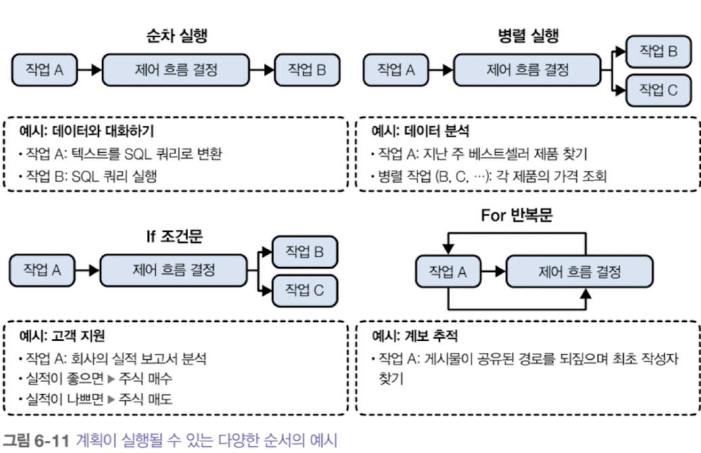
            
    - 성찰 및 오류 수정
        - Reasoning: ReAct 논문에서 처음 제안되었으며, 작업 해결을 위해 계획 → 행동 → 분석(성찰)을 반복함
    - 도구 선택
        - 실험을 통해 신중하게 선택해야한다. (도구가 많을수록 에이전트의 능력은 향상되지만, 효율적으로 사용하기는 어려워진다)
        - X→Y 도구 사용의 흐름이 자주 보인다면 합쳐도 되지 않을까? 새로운 Skill로 작용
</aside>

### 6.2.4 에이전트 실패 유형과 평가(실패를 발견하는 과정)

- 에이전트 실패 유형
    - 도구 사용 실패
        - 유효하지 않은 도구
        - 유효한 도구, 유효하지 않은 파라미터
        - 유효한 도구, 잘못된 파라미터
    - 목표 달성 실패
        - 계획이 작업을 해결하지 못하거나, 제약 조건을 따르지 않고 작업을 해결하기 때문이다
    - 성찰 오류
        - 작업을 완료하지 못했는데도 완료했다고 확신하는 경우
    - 도구 실패
        - 올바르게 도구를 사용했지만, 결과가 잘못된 경우
    - 효율성
        - 유효한 계획을 세워 작업을 완수할 수 있더라도, 과정이 비효율적일 수 있다.
        - 판단기준
            - 작업 완료를 위해 몇 단계가 필요한가?
            - 평균적인 소요 비용
            - 평균적인 소요 시간

- 계획 수립 과정에서의 에이전트 평가 방법
    - 작업, 도구 목록 쌍으로 구성된 계획 수립 데이터셋을 만들고 → 실제 출력을 분석한다.

## 6.3 메모리

- 모델이 정보를 저장하고 활용할 수 있게하는 방식
    - 내부 지식: 모델이 데이터에서 학습한 지식을 저장하고 있기 때문에 그 자체로 기억 시스템이라고 할 수 있다.
    - 단기 메모리: 모델의 컨텍스트, 작업이 끝나면 사라지는 기억
    - 장기 메모리: 모델이 검색을 통해 접근할 수 있는 외부 데이터 소스(RAG 시스템 등)

- 메모리 시스템 도입의 이점
    - 세션 내 과부하 관리
    - 세션 간 정보 유지
    - 모델의 일관성 향상
    - 데이터 구조 무결성 유지