# 7장. 파인튜닝

날짜: 2026년 1월 7일
담당자: 김성언
진행 상태: In Progress

# 7장. 파인튜닝

<aside>

파인튜닝은 모델의 가중치를 조정하는 방식으로, 다양한 측면을 향상시킬 수 있다
(도메인별 능력, 안전성, 모델의 지시 수행 능력[특정 출력 스타일, 형식])

언제 파인튜닝을 하고 언제 RAG를 해야하는가?

파라미터 효율적 파인튜닝(PEFT: Parameter-efficient-finetuning)은 무엇인가?

발전하는 PEFT의 방식은 무엇인가?

</aside>

## 7.1 파인튜닝 개요

### 전이 학습(Transfer Learning)

- 1976년 보지노프스키와 풀고시가 처음 제안한 개념
- 한 작업에서 얻은 지식을 새롭지만 관련된 작업에 활용해 학습 속도를 높이는 데 중점을 둔다.
    
    → 사람이 지식과 기술을 전이하는 방식과 개념적으로 비슷하다.(피아노를 칠 줄 알면 다른 악기를 더 쉽게 배우는 것과 같은 개념)
    
    → 데이터가 부족하거나 구하기 어려운 작업에 좋은 해결책이 되어왔다.(풍부한 데이터가 있는 작업에서 기본 모델을 학습시킨 다음, 그 지식을 목표 작업에 활용하는 방식)
    
- 대규모 성공 사례:
    - 구글의 다국어 번역 시스템(포르투갈어-영어, 영어-스페인어 번역 지식을 통해 포르투갈어-스페인어 번역을 가능케함)
    - 텍스트 완성애서 사전 학습으로 얻은 지식을 법률 질의 응답이나 Text-to-SQL 변환 같은 더 전문적인 작업(보통 데이터가 적은)으로 전이한다.

<aside>

표본 효율성(Sample Efficiency)를 높여 모델이 더 적은 예시로도 같은 행동을 학습할 수 있게 한다.

</aside>

cf) 파인튜닝(사전 학습 이후에 모델을 추가로 학습시키는 과정을 통칭)은 사용자가 프롬프트만으로는 끌어내기 어려운 능력을 활용 가능하게 만드는 것

### 지속적 사전 학습(Continued pre-training)

모델 학습은 보통 자기 지도 학습 방식의 사전 학습에서 시작한다. 비싼 데이터로 사전 학습 모델을 파인튜닝하기 전에, 저렴한 관련 분야 데이터로 먼저 자기 지도 학습을 적용해 볼 수 있다. 

ex) 법률 질의 응답을 위해 모델을 파인튜닝할 때는 비싼 (질의, 응답) 형태의 주석 데이터로 파인튜닝하기 전에 본 법률 문서로 파인튜닝할 수 있다. 

- 언어 모델
    - 자기회귀 언어 모델: 이전 토큰들을 컨텍스트로 사용해 시퀀스의 다음 토큰을 예측
    - 마스크 언어 모델: 앞뒤 토큰을 모두 활용해 빈칸을 채움
    
    → 인필링 파인튜닝(Infilling finetuning): 지도 학습을 통해 모델을 파인튜닝 할 수 있다.
    

### 지도 파인튜닝

- 사람의 사용 방식과 선호도에 맞게 조정하는 학습이다
- 입출력 쌍으로 모델을 학습하며 Q&A, 요약, 분류 등의 개방형 및 폐쇄형 답변 등의 형태가 모두 가능하다.
- 강화 학습을 통해 사람의 선호도를 최대화하는 응답을 생성하도록 파인튜닝할 수 있다.

### 롱 컨텍스트 파인튜닝(Long-context finetuning)

- 컨텍스트 길이를 늘리기 위해 적용하는 파인튜닝
- 위치 임베딩 조정과 같은 모델 구조의 수정이 필요하며, 다른 파인튜닝 기법보다 더 까다롭다(숏 시퀀스에서 성능이 떨어질 수도 있음)
- 롱 시퀀스 = 토큰의 가능한 위치가 더 많다. (위치 임베딩이 이를 처리할 수 있어야 한다)

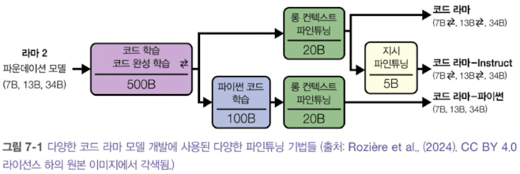

### 직군 별 경험하는 파인튜닝

- 모델 개발자
    - 주로 모델을 출시하기 전에 다양한 파인튠이 기법으로 모델을 사후 학습한다.
    - 각기 다른 정도로 파인튜닝된 여러 모델 버전을 출시할 수도 있어, 애플리케이션 개발자가 자신에게 가장 적합한 버전을 고를 수 있게 할 수도 있다.
- 애플리케이션 개발자
    - 사전 학습된 모델을 파인튜닝할 수도 있지만, **대개는 사후 학습된 모델을 파인튜닝하게 된다.**

## 7.2 파인튜닝이 필요한 경우

<aside>

파인튜닝은 많은 데이터, 고사양 하드웨어, ML 전문가가 필요하므로 프롬프트 기반 방법을 충분히 시도한 후에 파인튜닝을 시도하는 것이 일반적이다.

</aside>

### 7.2.1 파인튜닝을 해야 하는 이유

- 파인튜닝을 통해 일반 능력과 특정 작업 수행 능력(YAML, JSON 등의 특정 구조의 출력을 생성할 때)을 모두 향상시킬 수 있다.
- 다양한 벤치마크에서 뛰어난 성능을 보이는 범용 모델이 특정 작업에서는 성능이 떨어질 수 있다.
    
    ex) Text-to-SQL 작업에는 뛰어난 기본 모델이 덜 흔한 SQL 문법에서 실패할 수 있다.
    
    → 해당 SQL 문법이 포함된 데이터로 모델을 파인튜닝하면 도움이 된다.
    
- 파인튜닝은 편향 완화(학습 데이터의 특정 편향을 상쇄)에도 활용할 수 있다.
    
    ex) CEO를 항상 남성 이름으로 지정한다면, 여성 CEO가 포함된 데이터로 파인튜닝해 편향을 줄일 수 있다.
    
- 증류(Distillation):
    - 큰 모델이 생성한 데이터로 작은 모델을 학습시켜, 마치 큰 모델처럼 작동하게 만드는 방식.
    - 큰 모델의 지식을 더 작은 모델에 효율적으로 전달하는 과정
- 특정 작업에 파인튜닝된 작은 모델이 같은 작업에서 훨씬 더 큰 기본 모델보다 뛰어난 성능을 보일 수 있다.
    - 그래머리(Grammarly) 파인튜닝된 Flan-T5 모델이 텍스트 편집에 특화된 GPT-3 변형보다 다양한 글쓰기 보조 작업에서 더 좋은 성능을 보여줬다. (파인튜닝에서 60배나 작은 데이터인 82,000개의 [지시, 출력] 쌍을 사용)

### **7.2.2 파인튜닝을 하지 말아야 하는 이유**

1. **Allignment Tax**
    1. 학습한 작업에는 성능이 향상될 수 있지만, 다른 작업에서는 오히려 성능이 떨어질 수 있다.
        
        ex) 3가지 작업을 수행하는 모델에 대해 부족한 1가지에 대해 학습한다면, 나머지 2가지 작업에 대해 성능이 떨어질 수 있다.
        
        → 모든 작업에 대해 모델을 파인튜닝할 수 있다.
        
        → If. 어렵다면, 다른 작업에 별도 모델을 사용할 수 있다.(모델 병합 서빙)
        
    
    <aside>
    
    파인튜닝은 초기 투자가 크고 지속적인 관리가 필요한 작업이라 가장 먼저 시도할 방법이 아니다.
    
    - 데이터가 필요하다.
    - 모델 학습 방법에 대한 지식이 필요하다.(Optimizer, LR, Data, 과적합/과소적합, 평가 등)
    - 서빙하는 방법에 대한 지식이 필요하다.(직접 호스팅? API 서비스 사용?)
    </aside>
    

모델을 모니터링이 하고 유지보수하며 업데이트하기 위한 정책과 예산을 수립해야 한다. 

cf) 내가 공들여 파인튜닝한 모델보다 특정 작업에 더 뛰어난 성능을 보이는 베이스 모델이 등장했다면,

**성능이 얼마나 좋아져야 새로운 베이스 모델로 갈아탈 가치가 있을까?**

새로운 모델이 파인튜닝을 거치면 더 좋아질 잠재력을 보인다면 어떤 모델로 실험해야 할까?

→ Sol. 모델을 바꿔도 성능 향상은 미미한 수준에 그치는 경우가 많다. 따라서 **`체계적인`** 프롬프트 엔지니어링이 가장 중요하다.

<aside>

**도메인 특화 작업 파인튜닝의 모순,,?**

- 범용 모델이 특정 도메인 기반 학습 모델에 비해 **특정 도메인**에서 더 나은 성능을 보일 수 있다.
</aside>

### 파인튜닝과 프롬프팅 실험

- 프롬프트 실험
    - 평가 파이프라인, 데이터 주석 가이드라인, 실험 추적 방법 등을 구축할 수 있다.(파인튜닝의 기반)
- 파인튜닝
    - **프롬프트 캐싱이 도입되기 전까지,** 파인튜닝은 토큰 사용을 최적화 측면에서 유리했다.
        - 프롬프트에 예시를 많이 넣을수록 모델이 처리해야 할 입력 토큰이 늘어나 처리 속도가 느려지고 비용도 증가한다.
        
        → 프롬프트 캐싱 기술 도입 이후, 이러한 장점은 크게 줄어들었다. 
        (여전히 컨텍스트 길이 제한 측면에선 장점이 있다.)
        

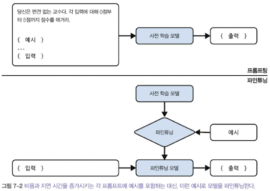

### 7.2.3 파인튜닝과 RAG

- **`모델이 정보가 부족(출력 내용이 사실과 다르거나 정보가 오래된 경우)해서 오답을 내놓는다면`**,
    - 관련 정보 소스에 접근할 수 있게 해주는 RAG 시스템을 도입
    - 시스템에 외부 지식을 제공해 더 정확하고 유익한 응답을 만들 수 있게 한다.

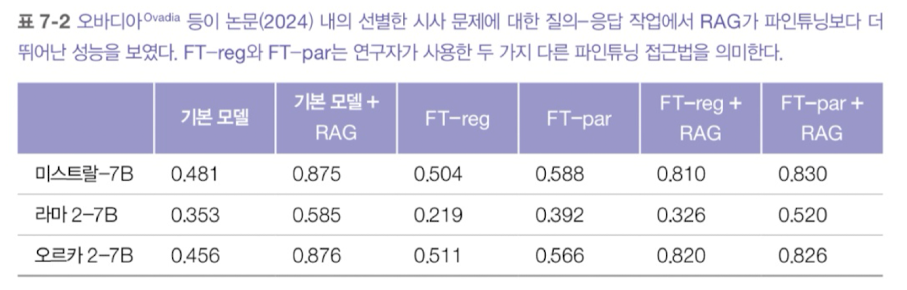

→ 기본 모델에 RAG를 적용한 것이 파인튜닝된 모델에 RAG를 적용한 것보다 더 좋은 성능을 낼 수 있다.

→ **파인튜닝이 특정 작업의 성능을 높여줄 수 있지만, 다른 영역에서는 오히려 성능이 떨어질 수 있음을 보여준다.**

- **`모델의 행동 방식에 문제(출력이 사실 관계는 맞지만 요청한 작업과 전혀 무관한 경우)가 있다면`**,
    - 파인튜닝을 도입
    - 특정 문구와 스타일을 이해하고 따르는 데 도움을 준다
    - 저품질 데이터로 학습한다면 오히려 환각 현상을 더 심하게 만들 수 있다.
- **`모델이 원하는 출력 형식을 제대로 따르지 못한다면`**,
    - 파인튜닝을 도입

ex) 시맨틱 파싱(Semantic parsing): 자연어를 JSON 같은 구조화된 형식으로 변환하는 과정

→ 모델이 정해진 형식에 맞춰 출력을 생성하는 능력이 중요하다.

<aside>

**파인튜닝은 형식을 위한 것이고, RAG는 사실을 위한 것이다.**

정보(RAG)와 행동(파인튜닝) 측면 모두에 문제가 있다면 쉽게 접근할 수 있는 RAG 부터 시작할 것

RAG 구현도 벡터 DB 보다는 간단한 키워드 기반의 검색(ex: BM25) 부터 시작할 것

</aside>

> RAG와 파인튜닝은 상호 배타적이지 않다.
둘을 함께 사용해서 애플리케이션의 성능을 극대화할 수 있다.
But, 같이 사용하는 것이 단독 사용보다 낮은 성능을 보일 수 있다.
> 
> 
> 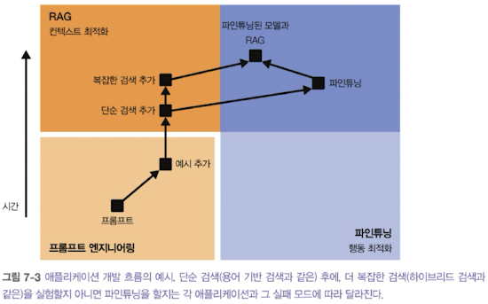
> 

### 모델 평가 기준 및 평가 파이프라인 설계

- 시작 단계뿐만 아니라, 전체 과정의 모든 단계에서 지속적으로 이루어진다.
    - 프롬프트만으로 모델이 원하는 작업을 수행하도록 해본다.(5장 참고)
    - 프롬프트에 더 많은 예시를 추가한다. 사용 사례에 필요한 예시의 수는 1~50개 정도다.
    - 모델이 정보 부족으로 인해 자주 오류를 보인다면, 관련 정보를 제공할 수 있는 데이터 소스에 연결한다. (RAG는 단순한 키워드 기반 검색부터 도입하여 성능 향상을 관찰한다.)
    - 모델의 오류 유형에 따라 다음 단계를 각각 실행한다.
        - 계속해서 정보 관련 오류를 보인다면, 임베딩 기반 검색 등의 **고급 RAG 방법을 시도**해본다.
        - 관련 없는 내용을 생성하거나, 형식이 잘못되거나, 안전하지 않은 응답을 생성하는 등의 행동 측면의 문제가 지속된다면 파인튜닝을 고려한다.
    - 더 높은 성능 향상을 위해 RAG와 파인튜닝을 함께 활용한다.

<aside>

If. 파인튜닝을 하기로 결정했다면,

가장 큰 난관인 **메모리 병목 현상(Memory bottleneck)**에 대해 고려해야 한다.7

</aside>

## 7.3 메모리 병목 현상

<aside>

### 메모리 병목 현상 이해를 위한 핵심 내용

- 파운데이션 모델의 큰 규모로 인해, 추론과 파인튜닝 모두에서 메모리가 주로 병목 지점이 된다.
신경망 학습 방식의 특성상 파인튜닝에 필요한 메모리는 일반적으로 추론보다 훨씬 더 많다.
- 파인튜닝 중 모델의 메모리 사용량에 큰 영향을 미치는 요소는 전체 파라미터 수, 학습 가능한 파라미터 수, 그리고 수치 표현 방식이다.
- 학습 가능한 파라미터가 많을수록 메모리 사용량이 늘어난다. 학습 가능한 파라미터 수를 줄이면 파인튜닝에 필요한 메모리를 줄일 수 있다. 이것이 바로 파라미터 효율적 파인튜닝(PEFT)의 핵심 아이디어다.
- 양자화는 모델을 더 많은 비트 형식에 더 적은 비트 형식으로 변환하는 기법이다. 이는 모델의 메모리 사용량을 줄이는 간단하고 효과적인 방법이다.
- 추론은 보통 16비트, 8비트, 4비트 처럼 가능한 작은 비트를 사용해 수행한다.
- 학습은 수치 정밀도에 더 민간해서 낮은 정밀도로 모델을 학습하는 것이 어렵다. 따라서 학습은 주로 혼합 정밀도 방식을 사용하는데, 일부 연산은 더 높은 정밀도(32비트)로, 나머지는 낮은 정밀도(16, 8비트)로 처리한다.
</aside>

### 7.3.1 역전파와 학습 가능한 파라미터(Trainable parameter)

- 역전파 메커니즘
    - 순방향 패스: 입력값에서 출력값을 계산하는 과정
    - 역방향 패스: 순방향 패스에서 집계된 신호를 활용해 모델의 가중치를 업데이트하는 과정
        - 순방향 패스에서 계산된 출력값과 예상 출력값(정답)을 비교한다. 
        값이 다르다면(모델이 실수를 했다면), 파라미터를 조정해야한다.
        이때, 계산된 출력값과 예상 출력값의 차이를 손실이라고 부른다.
        - 각 학습 가능한 파라미터가 이 실수에 얼마나 기여했는지 계산한다(그래디언트). 수학적으로 그래디언트는 각 학습 가능한 파라미터에 대해 손실의 미분을 통해 계산된다. 학습 가능한 파라미터마다 하나의 그래디언트 값이 있다. 만약 어떤 파라미터의 그래디언트가 높다면, 그것은 손실에 크게 기여했으므로 더 많이 조정해야한다.
        - 해당 그래디언트를 사용해 학습 가능한 파라미터 값을 조정한다. 그래디언트 값에 따라 각 파라미터를 얼마나 재조정할지는 옵티마이저가 결정한다. 일반적으로 옵티마이저는 확률적 경사 하강법(Stochastic gradient descent)과 Adam이 있다. (Transformer에선 Adam을 많이 사용)
            
            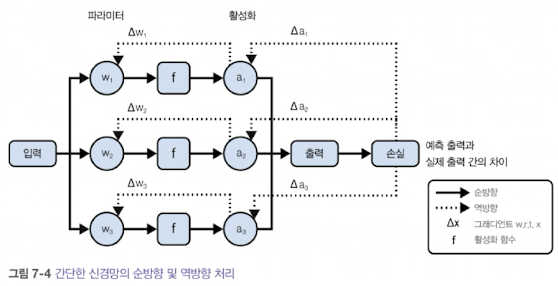
            
            3개의 파라미터와 하나의 비선형 활성화 함수를 가진 가상의 신경망에 대한 순방향 및 역방향 패스를 시각화 한 것
            
            cf) 역방향 패스 동안 각 학습 가능한 파라미터는 그래디언트와 옵티마이저 스테이트 같은 추가 값들을 동반한다. 
            → 학습 가능한 파라미터가 많을수록 추가 값을 저장하기 위한 메모리도 더 많이 필요하다.
            

### 7.3.2 메모리 계산

- 모델에 적절한 하드웨어를 선택하기 위해 모델에 필요한 메모리 양을 미리 아는 것은 유용하다.
- 이미 보유한 하드웨어로 특정 모델을 실행할 수 있는지 계산해야 할 수도 있다.
- 모델의 메모리 사용량은 모델 자체뿐 아니라 작업 부하와 메모리 사용량을 줄이기 위한 다양한 최적화 기법에 따라 달라진다.

- 추론에 필요한 메모리
    - 추론 중에는 순방향 패스만 실행된다. 순방향 패스에는 모델 가중치를 위한 메모리가 필요하다.
        - 모델 파라미터 수(N), 각 파라미터에 필요한 메모리(M)
        - 모델 파라미터 로드 시 필요한 메모리 = **N x M**
    - 순방향 패스에는 활성화(Activation) 값을 위한 메모리도 필요하다.(시퀀스 길이, 배치 크기에 비례하여 증가)
    - **트랜스포머 모델**은 어텐션 메커니즘을 위한 Key-Value 벡터에도 메모리가 필요하다.(시퀀스 길이, 배치 크기에 비례하여 증가)
    
    <aside>
    
    활성화 및 Key-Value 벡터에 필요한 메모리는 모델 가중치 메모리의 약 20%로 가정할 수 있다.
    
    cf) Long Context 나 큰 배치 크기를 사용한다면, 실제로 필요한 메모리는 더 많아질 것이다.
    
    → **모델의 메모리 사용량 = N x M x 1.2**
    
    </aside>
    

- 학습에 필요한 메모리
    - 앞서 다룬 모델 가중치와 활성화를 위한 메모리 +
    - **그래디언트와 옵티마이저 스테이트를 위한 메모리**가 필요하다.(학습 가능한 파라미터 수에 비례)
    - 학습 메모리 = 모델 가중치 + 활성화 + 그래디언트 + 옵티마이저 스테이트
        
        cf) 옵티마이저 스테이트는 옵티마이저에 따라 그래디언트용 값 하나와 함께 0~2개로 결정된다.
        
        - 기본 SGD는 스테이트가 0개
        - 모멘텀 옵티마이저는 학습 가능한 파라미터당 스테이트를 1개 저장한다.
        - Adam 옵티마이저는 학습 가능한 파라미터당 스테이트를 2개 저장한다.
    - Adam 옵티마이저로 130억 파라미터 모델의 모든 파라미터를 업데이트
        - 각 학습 가능한 파라미터는 그래디언트 값 하나와 두 개의 옵티마이저 스테이트(총 3개)
        - 각 값을 2바이트로 저장한다고 가정하면,
            - 그래디언트와 옵티마이저 스테이트에 필요한 메모리: 
            **130억 x 3 x 2바이트 = 78GB**
            
            cf) 학습 가능한 파라미터가 10억 개만 있다면,
            
            그래디언트와 옵티마이저 스테이트에 필요한 메모리:
            **10억 x 3 x 2바이트 = 6GB**
            
            → 활성화에 필요한 메모리가 모델 가중치 메모리보다 작다고 가정한 상황
            → 실제로는 활성화 메모리가 훨씬 더 클 수 있다.(그래디언트 계산을 위해 활성화르 저장한다면,)
            
    - 활성화 메모리를 줄이는 방법
        - 활성화를 아예 저장하지 않는 것
            
            = 활성화를 재사용하기 위해 저장하는 대신, 필요할 때 마다 재계산 하는 방식
            
            = 그래디언트 체크포인팅(Gradient checkpointing)
            
            = 활성화 재계산(Activation recomputation)
            
            → 메모리 요구량은 줄여주지만, 재계산으로 인해 학습 시간이 늘어난다.
            
            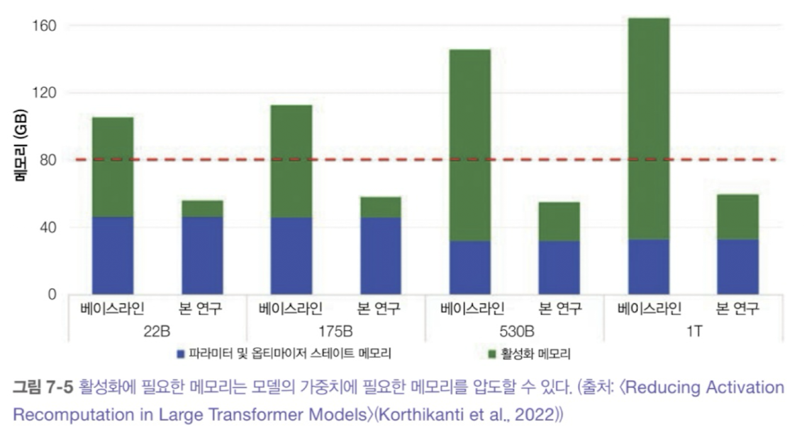
            

### 7.3.3 수치 표현 방식

- 지금까지 메모리 계산에서 각 값이 2바이트의 메모리를 차지한다고 가정
    - 각 값에 필요하 메모리를 절반으로 줄이면, 모델 가중치에 필요한 메모리도 절반으로 줄어든다.
- 신경망의 수치 값은 전통적으로 부동소수점 수로 표현된다.
(IEEE의 부동소수점 산술 표준(IEEE 754)을 준수하는 FP 계열이다.)
    - FP32는 부동소수점을 표현하기 위해 32비트(4바이트)를 사용하며, 이를 단정밀도(Single precision)라고 한다.
    - FP64는 64비트(8바이트)를 사용하며 배정밀도(Double precision)라고 한다.
    - FP16은 16비트(2바이트)를 사용하며 반정밀도(Half precision)라고 한다.
- FP64는 여전히 많은 계산에 사용되고 있지만, 메모리 사용량 때문에 신경망에서는 거의 사용되지 않는다.
- FP32, FP16이 더 일반적이다.
- AI 워크로드에서 다른 인기 있는 다른 부동소수점 형식은 BFloat16(BF16)과 TensorFloat-32(TF32)가 있다.(BF16: 구글이 TPU에서 AI 성능을 최적화하기 위해 설계, TF32는 엔비디아가 GPU를 위해 설계)
- 정수 표현 방식도 점점 더 인기를 얻고 있다
    - INT8(8비트 정수)
    - INT4(4비트 정수)
- 각 부동소수점 형식은 숫자의 부호(음수, 양수)를 나타내기 위해 1비트를 사용하며, 나머지 비트는 범위와 정밀도로 나뉜다.
    - 범위
        - 범위 비트 수는 형식이 표현할 수 있는 값의 범위를 결정한다. 비트가 많을수록 더 넓은 범위를 표현할 수 있다.
    - 정밀도
        - 정밀도 비트 수는 숫자를 얼마나 정확하게 표현될 수 있는지 결정한다. 정밀도 비트 수를 줄이면 숫자의 정밀도가 떨어진다.
    
    cf) 보통 고정밀도 형식의 숫자를 저정밀도 형식으로 변환하면 정밀도가 낮아진다.(FP32 → FP16)
    정밀도를 낮추면 같이 변하거나 오류가 발생할 수 있다. 
    

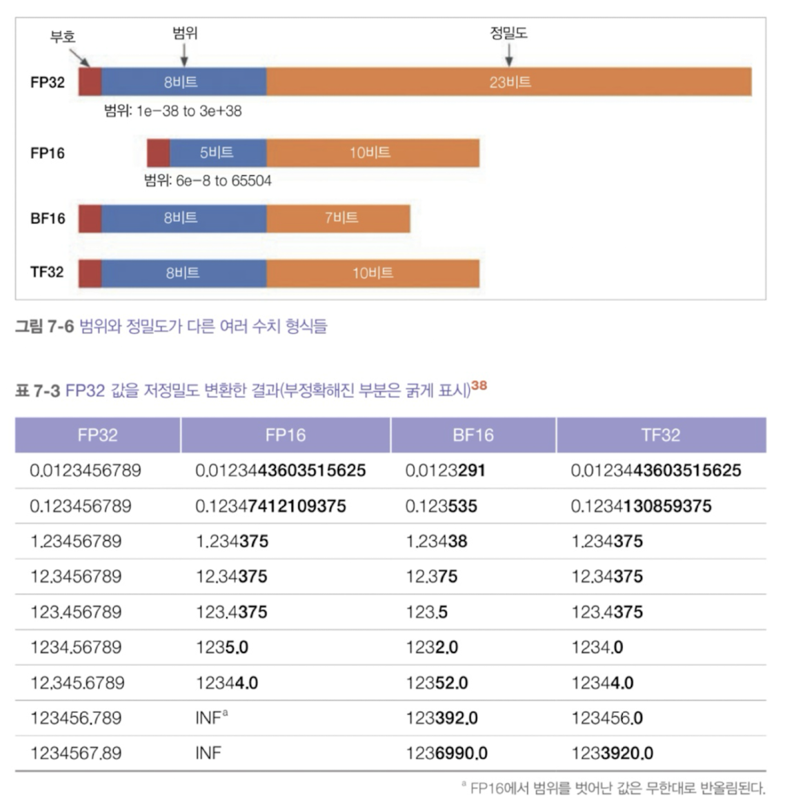

<aside>

BF16과 FP16이 같은 비트 수를 가졌지만, BF16은 범위에 더 많은 비트를, 정밀도에는 더 작은 비트를 할당한다.

→ BF16은 FP16에서 표현 불가능한 큰 값도 표현할 수 있다. 

→ But, 이로 인해 BF16은 FP16보다 정밀도가 떨어진다.

</aside>

> 모델을 사용할 때는 반드시 지정된 형식으로 모델을 로드해야한다. 잘못된 수치 형식으로 모델을 로드하면 성능이 크게 저화될 수 있다.
> 

### 7.3.4 양자화

- 모델 값을 표현하는 데 필요한 비트 수가 적을수록, 모델의 메모리 사용량도 줄어든다.
    
    ex) 100억 파라미터 모델이 32비트 형식이면 가중치에 40GB가 필요하지만, 같은 모델이 16비트 형식으로 표현하면 20GB면 충분하다.
    
- 정밀도를 낮추는 것(= 양자화)은 모델의 메모리 사용량을 줄이는 저렴하면서도 매우 효과적인 방법이다.
- ML 분야에서 저정밀도는 일반적으로 표준 FP32보다 적은 비트를 가진 모든 형식을 의미한다.

<aside>

### 양자화와 정밀도 감소

엄밀히 말하면, 대상 형식이 정수일 때만 양자화라고 해야 한다.
그러나, 실제로는 값을 저정밀도 형식으로 변환하는 모든 기법을 양자화라고 부른다.
책에서는 정밀도 감소를 양자화라고 표현한다.

</aside>

- 양자화 점검 체크 리스트
    - 무엇을 양자화할 것인가?
        - 원칙적으로 메모리를 가장 많이 차지하는 요소부터 양자화하는 것이 이상적이다.
        - 실제로는 성능 저하 없이 적용할 수 있는 부분이 무엇인지에 따라 신중하게 대상을 선택해야한다. 7.3.2에서 설명했듯이, **추론 모델의 메모리 사용량에 큰 영향을 미치는 요소는 모델의 가중치와 활성화 값이다**. 이 중에서 가중치 양자화가 활성화 양자화보다 더 일반적으로 사용되는데, 이는 **가중치 양자화가 대체로 더 안정적이고 정확도 손실이 적기 때문이다.**
    - 언제 양자화할 것인가?
        - 양자화는 학습 중이나 학습 후에 진행할 수 있다. **학습 후 양자화(PTQ: post-training quantization)**는 모델이 완전히 하습된 후에 양자화하는 것을 말한다. PTQ는 가장 널리 사용되는 방식이다. 또한, 보통 모델을 직접 학습시키지 않는 AI 애플리케이션 개발자들에게  더 적합하다.

### 추론 양자화

- 딥러닝 초기에는
    - 32비트 FP32를 사용해 모델을 학습하고 서빙하는 것이 표준이었다.
- 2010년대 후반부터는
    - 16비트 및 더 낮은 정밀도로 모델을 서빙하는 것이 점점 보편화됐다.

- 혼합 정밀도
    - 상황에 맞춰, 가능할 때는 값의 정밀도를 낮추고 필요할 때는 높은 정밀도를 유지하는 방식
        - Apple
            - 기기에서 모델을 서빙하기 위해 2, 4비트 형식을 혼합해 평균 가중치당 3.5비트를 사용하는 양자화 방식을 도입
        - NVIDIA
            - 4비트 신경망 시대를 대비하기 위해 4비트 부동소수점으로 모델 추론을 지원하는 새로운 GPU 아키텍처인 블랙웰을 발표했다.

- 8비트 이하에서의 부동소수점
    - FP8(8비트), FP4(4비트) 같은 미니플로트 형식 중 하나를 사용해 파라미터 값을 부동소수점으로 유지할 수 있다.
    - 일반적으로는 파라미터 값은 INT8이나 INT4 같은 정수 형식으로 변환한다.

- 1비트 양자화 시대
    - 이론상 1비트보다 작게 양자화할 수 없다.
    - BinaryConnect, Xnor-Net,
    - BitNet v1.58: MS에서 공개한 파라미터 당 1.58비트 만을 필요로 하는 트랜스포머 기반 언어 모델

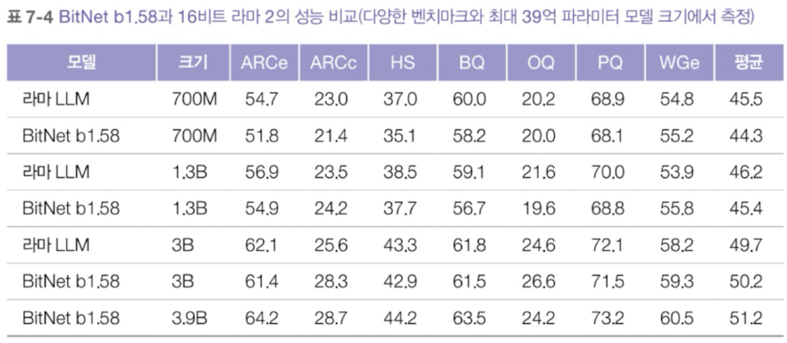

- 정밀도와 계산 속도의 관계
    - 정밀도를 낮추면 메모리 사용량이 줄어들 뿐 아니라 계산 속도도 향상되는 경우가 많다.
        - 더 큰 배치 크기를 사용할 수 있어 더 많은 입력을 병렬로 처리
        - 정밀도 감소로 추론 지연 시간과 학습 시간을 더욱 단축
            
            ex) 두 숫자의 덧셈
            
            - 비트별로 덧셈을 수행하고 각각 t 나노초가 걸린다면, 32비트는 32t 나노초가 걸리지만, 16비트는 16t 나노초가 걸린다.
            - But, 형식 변환에 필요한 추가 게산 등에 의해 시간이 줄지 않을 수 있다.

- 정밀도를 낮출 때의 단점
    - 변환 시에 발생하는 작은 값 변화들이 큰 성능 차이를 만들 수 있다.
    - 값이 낮아진 정밀도 형식의 표현 범위를 벗어나면 무한대나 임의의 값으로 변환될 수 있어 모델 품질이 예상보다 더 떨어질 수 있다.

- 추론에서의 정밀도 설정 표준
    - 모델은 성능을 최대화하기 위해 더 높은 정밀도 형식으로 학습된 다음, 추론을 위해 낮은 정밀도로 추론하는 것은 이제 표준이다. (Pytorch, TensorFlow, Huggingface 에서 PTQ를 쉽게 제공)

### 학습 양자화

- 목표
    - 추론 과정에서 낮은 정밀도에서도 우수한 성능을 보이는 모델을 만드는 것
    → 학습 후 양자화 과정에서 모델 품질이 저하될 수 있는 문제를 해결하기 위한 것
    - 학습 시간과 비용을 줄이는 것, 양자화는 모델의 메모리 사용량을 줄여 더 저렴한 하드웨어에서 모델을 학습하거나 같은 하드웨어에서 더 큰 모델을 학습할 수 있게 한다. + 계산속도를 높여 비용도 ㅊ가로 절감할 수 있다.

- 양자화 인식 함수(QAT: Quantization-aware training)
    - 추론 시 낮은 정밀도에서도 품질이 좋은 모델을 만드는 것
    - 학습 중에 낮은 정밀도(ex: 8비트) 동작을 시뮬레이션하므로, 낮은 정밀도에서도 품질 높은 출력을 생성하도록 학습할 수 있다.
    - But, 계산이 여전히 높은 정밀도로 이루어지기 때문에 모델의 학습 시간을 줄이지는 않는다
    - 낮은 정밀도 동작을 시뮬레이션하는 추가 작업으로 인해 학습 시간이 늘어날 수도 있다

- **혼합 정밀도** 기반의 낮은 정밀도 학습
    - 가중치 사본은 높은 정밀도로 유지하지만 그래디언트나 활성화 같은 다른 값은 낮은 정밀도로 유지하는 방식
    - 덜 민감한 가중치 값은 낮은 정밀도로 계산하고 더 민감한 가중치 값은 높은 정밀도로 계산할 수 있다.
    
    ex: LLM-QAT는 가중치와 활성화를 4비트로 양자화하지만 임베딩은 16비트로 유지한다.
    
    - 어떤 부분을 낮은 정밀도로 할지는 많은 ML 프레임워크가 제공하는 자동 혼합 정밀도(AMP: Automatic mixed precision) 기능을 통해 자동으로 설정할 수 있다.
    - 학습의 단계마다 다른 정밀도 수준을 사용하는 것도 가능하다.
        
        ex) 모델은 높은 정밀도로 학습하되 낮은 정밀도로 파인튜닝될 수 있다.
        파운데이션 모델에서 특히, 모델이 공개되면 컴퓨팅 접근성이 낮은 개발자들은 그 모델을 낮은 정밀도로 파인튜닝할 수 있다.
        

## 7.4 파인튜닝 기법

<aside>

- 메모리 효율적인 파라미터 기법(주로, 파라미터 효율적 파인튜닝)
- 모델 병합: 파인튜닝은 아니지만 파인튜닝을 보완하는 역할
</aside>

### 7.4.1 파라미터 효율적 파인튜닝

- 전체 파인튜닝: 모델의 전체 파라미터를 학습하는 방식
    
    ↔ 학습과의 차이점: 학습은 무작위화된 모델 가중치로 시작하는 반면, 파인튜닝은 이미 학습된 모델 가중치에서 시작한다.
    

<aside>

ex) 메모리 계산 예시 (70억 파라미터 모델)

- FP16의 16비트 형식을 사용하면, 모델 가중치만 로드하는 데  14GB의 메모리가 필요하다.
- Adam 옵티마이저로 이 모델을 16비트 형식으로 전체 파인튜닝하려면, 추가로 70억 x 3 x 2바이트 = 42GB의 메모리가 필요하다.
- 모델 가중치, 그래디언트, 옵티마이저 스테이트에 필요한 총 메모리는 
14GB + 42GB = 56GB다.
    
    → 대부분의 소비자용 GPU 메모리 용량을 초과한 크기,(12~48GB)
         + 활성화에 필요한 메모리를 아직 고려하지 않은 상태
    
</aside>

cf) CPU 오프로딩: 전체 모델을 GPU에 억지로 맞추려하는 대신, DeepSpeed 처럼 초과 메모리를 CPU로 넘길 수 있다.

→ 전체 파인튜닝의 높은 메모리와 데이터 요구사항 때문에 부분 파인튜닝(Partial Funetuning)을 시작하게 됐다. 
ex) 10개 레이어에서 9개 레이어만 고정하고 마지막 레이어만 파인튜닝하면 학습 가능한 파라미터 수가 전체 파라미터의 10%로 줄어든다.

> 부분 파인튜닝은 메모리 사용량을 줄일 수 있지만, 파라미터 효율성이 떨어진다.
> 

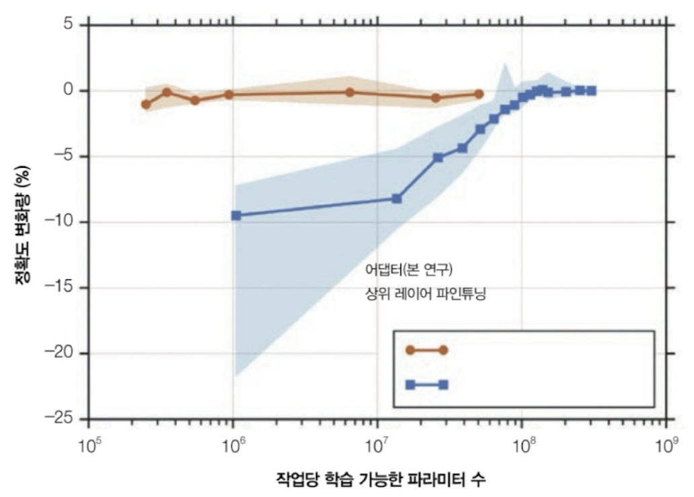

파란선은 부분 파인튜닝이 전체 파인튜닝과 비슷한 성능을 내기위해 많은 학습 가능한 파라미터가 필요하다는 것을 보여준다.(홀스비 등의 연구)

- BERT 대형 모델을 사용할 때  GLUE 벤치마크에서 전체 파인튜닝과 비슷한 성능을 달성하려면 전체 파라미터의 약 25%를 업데이트해야 한다.
    
    → HOW? : 파라미터 효율적 튜닝(PEFT: Parameter-efficient tuning)
    

### PEFT: Parameter-efficient tuning

- 모델의 적절한 위치에 추가 파라미터를 삽입해서 적은 수의 학습 가능한 파라미터만으로도 뛰어난 파인튜닝 성능을 달성할 수 있음
    
    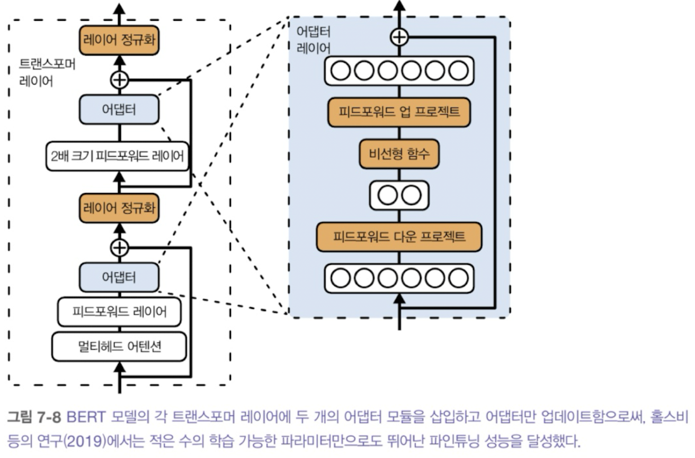
    
- BERT 모델의 각 트랜스포머 블록에 두 개의 어댑터 모듈을 추가하였다.
- 학습 가능한 파라미터의 수 == 어댑터 내 파라미터
- 전체 학습 가능한 파라미터의 3%만으로도 전체 파인튜닝과 비교해 성능 차이가 0.4% 이내인 성능을 달성
- 더 저렴한 하드웨어로도 파인튜닝이 가능해 훨씬 많은 개발자가 활용할 수 있게 해준다.
- 파라미터 효율적일 뿐만 아니라 샘플 효율적이기도 하다.
    - 전체 파인튜닝 시에 수만~수백만 개의 샘플이 필요하나,
    - 일부 PEFT 방법은 단 몇 천개의 예시만으로도 강력한 성능을 낼 수 있다.
- 단점
    - 파인튜닝된 모델의 추론 지연 시간이 늘어난다.
    - 추가 레이어를 도입해 순방향 패스에 더 많은 계산 단계를 추가하기 때문에 추론 속도가 느려진다.

### PEFT 기법

- 어댑터 기반 방법(Adapter-based method)
    - 모델 가중치에 추가 모듈을 붙이는 모든 방식(부가적 방법)
    - 대표적인 예시
        - LoRA
        - BitFit
        - IA3
        - LongLoRA
- 소프트 프롬프트 기반 방법(Soft prompt-based method)
    - 특별한 학습 가능한 토큰을 도입해 모델이 입력을 처리하는 방식을 바꾼다
    - 소프트 프롬프트 vs 하드 프롬프트
        - 읽을 수 있는가?
            - 소프트 프롬프트는 임베딩 벡터와 비슷한 연속적인 벡터로 사람이 읽을 수 없다.
            - 하드 프롬프트는 개별 토큰들을 포함하며 사람이 읽을 수 있다.
        - 학습이 가능한가?
            - 소프트 프롬프트는 튜닝 과정에서 역전파를 통해 최적화할 수 있어 특정 작업에 맞게 조정할 수 있다.
            - 하드 프롬프트는 고정되어 있고 학습이 불가능하다.

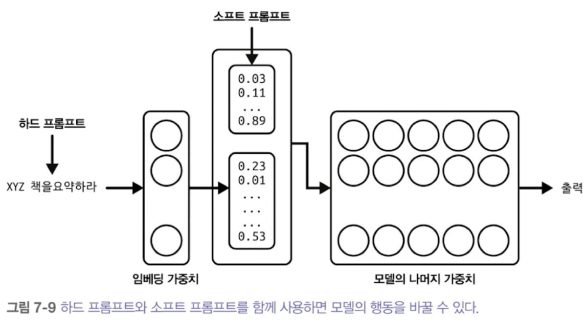

- 프리픽스 튜닝
    - 모든 트랜스포머 레이어의 입력 앞에 소프트 프롬프트 토큰을 붙임
- P-튜닝
- 프롬프트 튜닝
    - 임베딩된 입력 앞에만 소프트 프롬프트 토큰을 붙임

- PEFT 방법 별 이슈
    - LoRA가 현재 시장을 주도하고 있음을 확인할 수 있다.

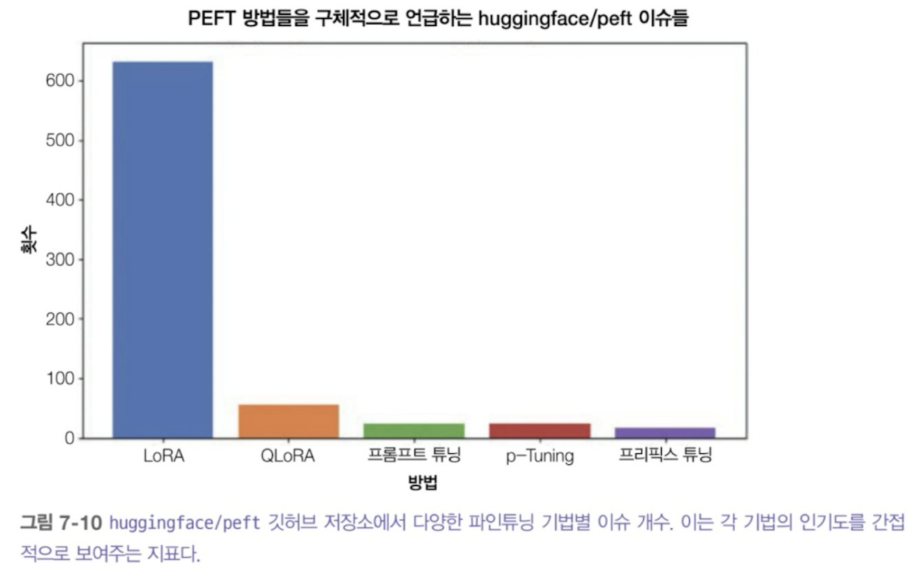

### LoRA의 작동 원리와 문제

- 홀스비 등의 연구에서 제안한 기존 어댑터 방식과 달리, LoRA(low-rank adaptation)는 추론 지연 시간을 추가로 발생시키지 않으면서 파라미터를 효과적으로 추가한다.
- 기본 모델에 새로운 레이어를 추가하는 대신, LoRA는 원래 레이어와 병합할 수 있는 모듈을 활용한다.
- 개별 가중치 행렬에 적용할 수 있다. 특정 가중치 행렬이 주어지면 이 행렬을 2개의 더 작은 행렬의 곱으로 분해하고, 이 작은 행렬들을 업데이트한 후 다시 원래 행렬로 병합하는 방식을 취한다.

<aside>

- LoRA 작동 방식
    
    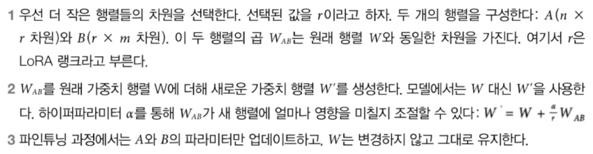
    
    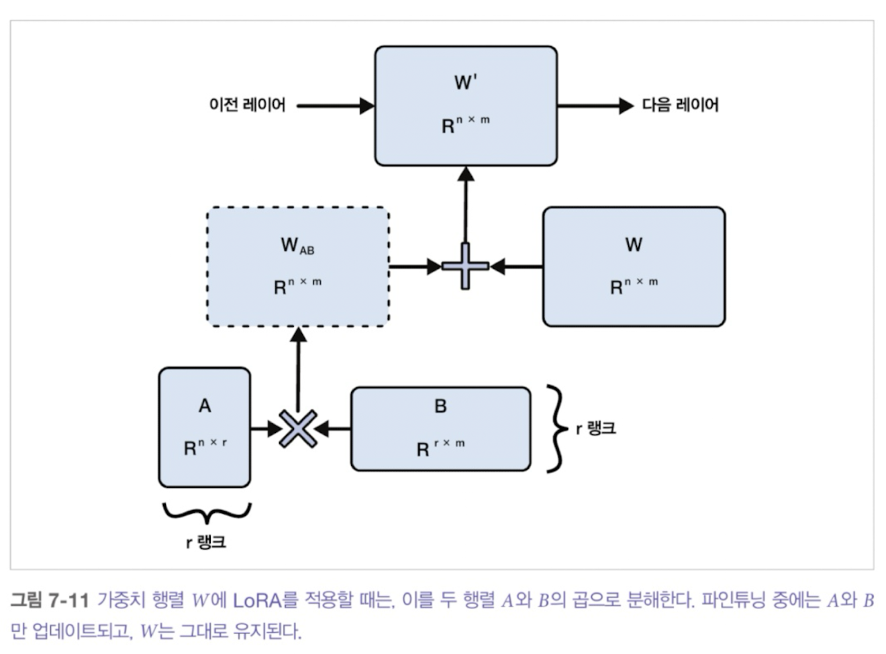
    
    - 오래전부터 활용되어 온 차원 축소 기법인 저랭크 분해 개념을 토대로 만들어졌으며, 핵심은 튼 행렬을 두 개의 작은 행렬 곱으로 분해해 파라미터 수를 줄여서 계산량과 메모리 요구사항을 줄여주는 데 있다.
    - 파라미터 수를 크게 줄일 수 있지만, 원래 행렬을 완벽히 재현하지 못하고 근사하기 때문에 정보 손실이 발생한다. 랭크가 높아질수록 분해된 행렬이 원래 행렬의 정보를 더 많이 보존할 수 있다.
    
    cf) GPT-3 대상 실험에서 전체 파인튜닝의 0.0027%인 4.7M개의 파라미터 만으로도 여러 작업에서 전체 파인튜닝과 비슷하거나 더 우수한 성능을 달성할 수 있었다.
    
</aside>

### LoRA가 왜 효과적일까?

- 왜 파라미터 효율성이 가능한 걸까?
- 왜 적은 데이터로도 높은 수준의 학습이 가능한 것일까?
    
    → LLM이 수많은 파라미터를 가지고 있음에도 실제로는 매우 낮은 내재적 차원(Intrinsic dimension)을 갖는다는 점을 보여주었다. (사전 학습 과정이 모델의 내재적 차원을 줄인다는 사실을 밝힘, 모델이 클수록 더 낮은 내재적 차원을 가짐)
    
    → 사전 학습이 다운스트림 작업을 위한 일종의 압축 프레임워크 역할을 한다는 의미
    
    ⇒ LLM이 더 잘 학습될수록, 적은 수의 학습 가능한 파라미터와 소량의 데이터만으로도 모델을 효괒거으로 파인튜닝하기가 더 쉬워진다.
    

### 사전 학습에도  LoRA를 사용하면 효과적이지 않을까?

- 처음부터 사전 학습을 위해 모델을 분해할 수는 없을까?
- 많은 연구자도 저랭크 사전학습은 모델의 파라미터 수를 대폭 줄여 학습 시간과 비용을 크게 절감할 수 있다고 생각했다.
- ReLoRA, GaLore 등의 시도가 있으나 사전 학습이 모델의 내재적 차원을 자연스럽게 압축하므로, 저랭크 분해가 효과적으로 작동할 수 있는 지점까지 모델의 내재적 차원을 충분히 줄이기 위해서는 풀랭크 사전 학습이 필요하다.

### LoRA 구성

- LoRA를 적용하려면 어떤 가중치 행렬에 LoRA를 적용할지와 각 분해의 랭크를 얼마나 설정할 것인지 결정해야한다.
- LoRA는 개별 가중치 행렬마다 적용할 수 있어서, 모델의 아키텍처에 따라 효율성이 결정된다.
- 보통 트랜스포머 모델에 사용되고 있고, 어텐션 모듈의 4가지 가중치 행렬(Wq, Wk, Wv, Wo)에 적용된다. [보통 모델 안의 같은 종류의 모든 행렬에 일괄적으로 적용]
- GPT-3-175B 파인튜닝 시에 학습 가능한 파라미터를 1,800만 개로 설정(전체의 0.01%)
    - 랭크가 8인 하나의 행렬
    - 랭크가 4인 두 개의 행렬
    - 랭크가 2인 네 개의 모든 행렬
    
    <aside>
    
    GPT-3-175B는 96개의 트랜스포머 레이어로 구성되어 있고, 모델 차원은 12,288이다. 랭크가 2인 네 개의 모든 행렬에 LoRA를 적용하면 레이어마다 (12,288 x 2 x 2) x 4 = 196,608개의 학습 가능한 파라미터가 생기고, 전체 모델에서는 18,874,368개의 학습가능한 파라미터를 갖게 된다.
    
    </aside>
    

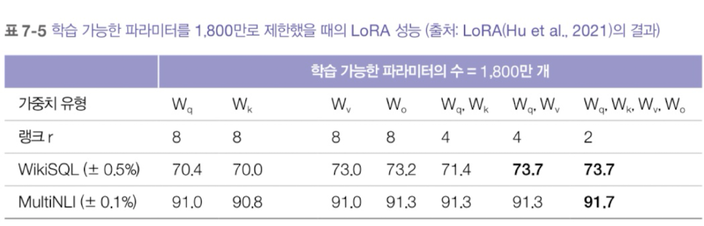

- Attention 행렬 중에서 2개만 선택해야하는 상황이라면, Query, Value 행렬을 택하는 것이 일반적으로 가장 효과적이다.

> 4~64 정도의 작은 r 값만으로도 대부분의 활용 사례에서 충분하다.
r 값을 특정 값 이상으로 늘려도 모델 출력 품질에 뚜렷한 개선을 기대하기 어렵다.
> 

- 알파 값(병합 과정에서 Wab 곱이 새 행렬에 얼마나 영향을 미칠지 결정하는 값)
    
    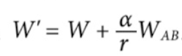
    
    - 보통 1 : 8 ~ 8 : 1 까지 다양함(실험을 통해 조합을 찾아야함)

### LoRA 어댑터 서빙

- 방법 1: 파인튜닝된 모델을 서빙하기 전에 LoRA 가중치 A와 B를 원본 모델에 미리 병합해서 새로운 행렬 W’를 만든다. 추론 시 추가 연산이 필요하지 않아서 지연 시간이 늘어나지 않는다.(서빙할 LoRA 모델이 하나뿐인 경우에 추천)
- 방법 2: 서빙 시 W, A, B 가중치를 각각 따로 유지한다. 이 경우 추론 과정에서 A와 B를 W에 병합해야 하므로 지연 시간이 늘어난다.(멀티 LoRA 서빙을 할 때 추천)
    
    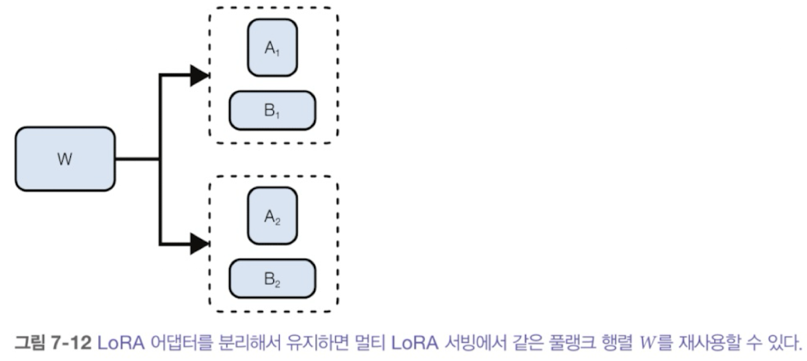
    
    - 지연 시간을 늘리긴 하지만, 저장 공간을 대폭 절약해준다.
        
        ex) 고객마다 LoRA로 모델을 파인튜닝한다고 생각하면 모델이 100개가 생기고, “방법 1”을 사용하면 풀랭크 행렬 W’을 100개 저장해야한다.
        
        “방법 2”를 사용하면 풀랭크 행렬 W 하나와 작은 행렬들(A, B) 100세트만 저장하면 된다.
        
        <aside>
        
        ex) 원본 행렬 W가 4096 x 4096 크기(1,680만 파라미터), LoRA의 랭크가 8이면 A와 B의 파라미터 수는 4096 x 8 x 2 = 65,536개다.
        
        - 방법 1: 풀랭크 행렬 W’ 100개의 총 파라미터는 1,680만 x 100 = 16억 8천만 개
        - 방법 2: 풀랭크 행렬 W 하나와 작은 행렬(A, B) 100 세트의 총 파라미터는 1680만 + 65,536 x 100 = 2,330만 개
            - 작업을 바꿀 때도 훨씬 빠르다. 고객 X의 모델을 서빙하고 있는데, 고객 Y의 서빙으로 바꿔야 한다면 전체 가중치 행렬을 새로 로딩할 필요 없이 Y의 LoRA 어탭터만 로딩하면 되므로 로딩 시간을 크게 줄일 수 있다.
        </aside>
        

### 멀티 LoRA 서빙을 활용한 전문화된 모델의 결합

- 여러 작업을 처리하는 거대하고 강력한 모델 하나 대신에
    
    각 작업마다 LoRA 어댑터를 따로 만들어서 다양한 기능에 활용
    
- LoRA 어댑터의 모듈성 활용
    - 파인튜닝 LoRA 어탭터들을 사용할 수 있다(Like 사전 학습 모델)

### LoRA의 단점

- 전체 파인튜닝 만큼 강력한 성능을 제공하지 못한다.
- 모델 구현을 수정해야 하므로 모델 아키텍처에 대한 이해와 코딩 기술이 필요해 전체 파인튜닝보다 더 어렵다
- HF PEFT, Axolotl, unsloth, LitGPT 등의 PEFT 프레임워크들은 기본 모델에 대해 LoRA를 별도 설정 없이 바로 사용할 수 있게 지원한다.

### 양자화된 LoRA

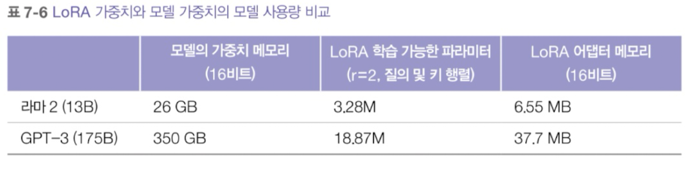

- LoRA 어댑터가 사용하는 메모리는 모델 가중치에 비해 매우 작다는 것을 알 수 있다. 따라서 LoRA 파라미터를 줄여봤자 전체 메모리 사용량은 거의 줄어들지 않는다.
- LoRA의 파라미터를 줄이는 것보다는 파인튜닝 할 때 “모델의 가중치, 활성화, 그래디언트”를 양자화하는 편이 메모리를 훨씬 효과적으로 절약할 수 있다.
- 양자화된 LoRA(QLoRA)
    - 파인튜닝할 때 모델 가중치를 16비트로 저장했는데, QLoRA는 4비트로 저장했다가 순전파와 역전파를 계산할 때만 다시 BF16으로 역양자화해서 쓴다.
    - NF4(NormalFloat-4)의 4비트 형식을 활용하며, 사전 학습된 가중치는 대개 중앙값이 0인 정규 분포를 따른다는 사실을 활용해 값을 양자화한다.
    - 롱 시퀀스 길이에서 GPU 메모리가 부족할 때 CPU와 GPU 사이에 데이터를 자동으로 전송하는 페이징 최적화 도구(Paged optimizer)를 사용한다.
        
        → 650억 파라미터 모델을 단일 48GB GPU에서 파인튜닝할 수 있다.
        
    - 다양한 크기의 모델을 4비트로 파인튜닝 했고, 좋은 성능을 보인 모델도 존재한다.
    - 한계
        - NF4 양자화 과정에 비용이 많이 든다.
        - 메모리 사용량을 줄여줄 수 있지만, **양자화하고 다시 되돌리는 과정에서 시간이 더 걸려서 학습 시간이 늘어날 수 있다.**
- 양자화된 LoRA 관련 연구: QA-LoRA, ModuLoRA, IR-QLoRA

### 7.4.2 모델 병합과 다중 작업 파인튜닝

- 모델 병합
    - 여러 모델을 결합하여 맞춤형 모델을 만드는 방법(유연성을 제공)
    - GPU 없이도 병합 가능
    - 개별 모델들을 따로따로 쓰는 것 보다 훨씬 유용한 하나의 통합 모델을 만듦
    - 이점
        - 각기 다른 강점을 가진 모델을 병합하여 성능 개선
        - 다른 작업을 담당하는 모델을 하나의 모델로 통합하여 메모리 사용량 절약(어댑터 기반 모델에서 특히 효과적)
        
- 다중 작업 파인튜닝(모델 병합 없이 여러 작업에 대한 파인튜닝(
    - 동시 파인튜닝
        - 모든 작업에 대한 예시를 하나의 데이터셋에 담아서 모델이 모든 작업을 동시에 학습하는 방법(여러 작업을 동시에 학습하는 것이 보통 더 어렵기 때문에, 많은 데이터와 많은 학습이 필요하다)
    - 순차 파인튜닝
        - 각 작업을 하나씩 순차적으로 모델을 파인튜닝하는 방법
        - 작업 A로 모델을 학습한 후, 작업 B에 대해 학습하는 방식
        - 모델이 한 번에 하나씩 배우는게 더 쉽다는 가정에서 나온 접근법
            
            → Catastrophic forgetting 현상에 취약하다.
            
    
- 모델 병합(병렬 튜닝 후 병합)
    - 스마트폰, 노트북, 자동차, 스마트워치, 창고 로봇 같은 기기에 모델을 배포해야할 때 (온디바이스 배포는 메모리 용량이 제한되어 쉽지 않다)
        - 데이터가 기가 밖으로 나갈 수 없거나, 인터넷 연결이 제한되거나 신뢰할 수 없는 경우
        - 추론 비용이 크게 감소함(데이터 센터를 거치지 않으므로)
        - 여러 기기가 별도의 데이터로 같은 모델을 학습하여 나온 다른 버전의 모델을을 모두 합쳐 하나의 새로운 기본 모델을 만든다.
    - 연합 학습(Federated learning)을 수행하는 방법
    
- 모델 앙상블 방법(Model ensemble method)
    - 모델 병합이 일반적으로 구성 모델의 파라미터를 섞어서 만드는 방식이라면, 앙상블은 일반적으로 각 구성 모델을 그대로 나둔 모델 출력만 결합하는 방식이다.
    - 3개의 모델을 사용해 서로 다른 3개의 응답을 생성할 수 있다.(생성 후, 다수결, 별도 ML 모듈을 통해 답변 도출) [여러 번 추론을 해야해서 비용이 더 든다]

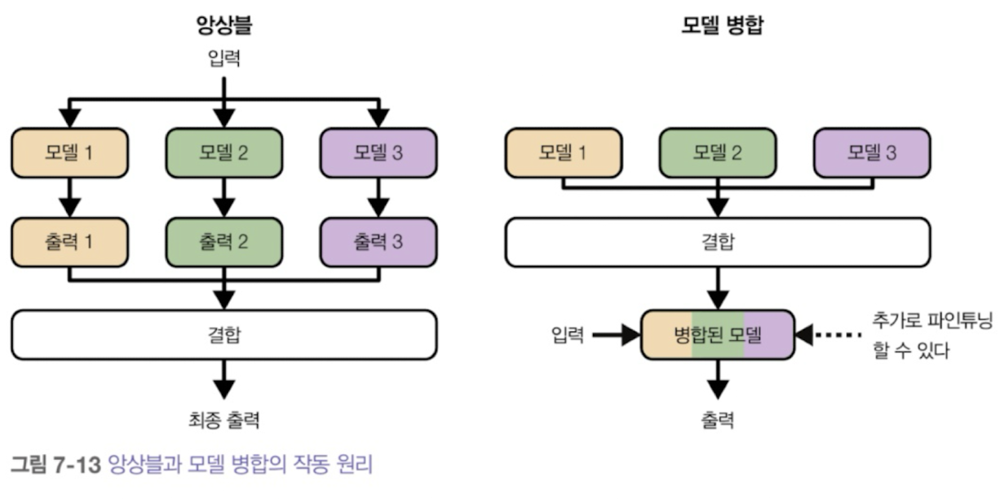

### 모델 병합 방법

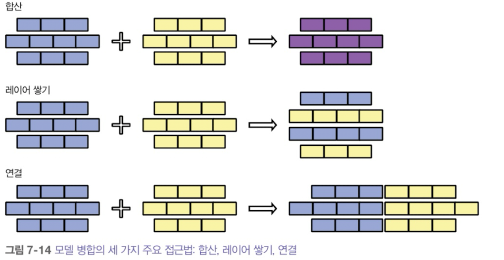

- 합산
    - 구성 모델들의 가중치 값들을 더하는 방식
    
    ex) 선형 결합, 구면 선형 보간법
    
    - 두 모델의 파라미터가 서로 다른 크기라면 합산하기 전에 모델들을 다시 조정하여 파라미터 값들이 비슷한 범위에 오도록 한다.
    - 선형 결합 [내용 보충 필요]
        
        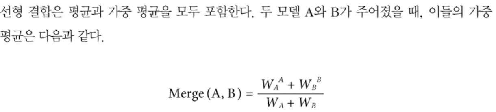
        
        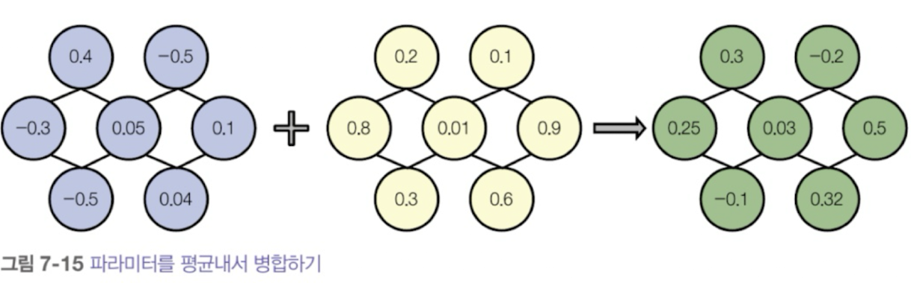
        
        - 평균과 가중 평균을 모두 포함(Wa = Wb = 1 일때 선형 결합 예시)
        - 모델 전체를 선형으로 결합할 수도 있고 일부만 결합할 수도 있다.
        - 어떤 모델 세트든 선형적으로 결합할 수는 있지만, 같은 기본 모델에서 파인튜닝된 모델들 끼리 결합할 때 가장 효과가 좋다.
    - 구면 선형 보간법(SLERP) [내용 보충 필요]
        - 보간: 알고 있는 값들을 바탕으로 모르는 값을 추정하는 방법, 모델 병합에서는 모르는 값이 병합될 모델이고 알고 있는 값들이 구성 모델들이다. 헌형 결합도 보간 기법 중 하나고, SLERP는 또 다른 보간 기법이다.)
- 레이어 쌓기(패스스루: Passthrough, 프랑켄머징: Frankenmerging)
    - 여러 모델에서 서로 다른 레이어를 가져다 차곡차곡 쌓아올리는 방법이다.
        
        ex) 모델 1에서 첫 번째 레이어를 가져오고, 모델 2에서 두 번째 레이어를 가져와서 연결하는 식이다. → 기존에 없던 고유한 아키텍처와 파라미터 수를 가진 모델을 만들 수 있다.
        
    - 합산 방식과는 다르게, **레이어 쌓기로 만든 모델은 제대로 된 성능을 내려면 추가 파인튜닝이 필요**
    - MoE(Mixture-of-Experts) 모델 학습할 때도 활용할 수 있다.
        
        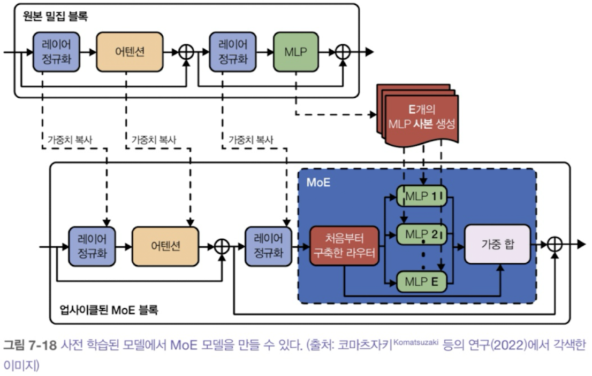
        
        - 사전 학습된 모델을 가져와 특정 레이어나 모듈을 여러 개 복사한다.
        - 라우터를 추가해서 각 입력을 가장 적합한 복사본으로 보낸다.
        - 그 다음 병합된 모델과 라우터를 함께 추가 학습시켜서 성능을 개선한다.
    - 모델 업스케일링
        - 적은 자원으로 더 큰 모델을 만드는 방법을 연구하는 분야
        - 더 큰 GPU로 더 큰 모델 구동이 가능할 때, 밑바닥 학습 대신 레이어 쌓기를 활용
        
        ex) 뎁스와이즈 스케일링(Depthwise scaling)
        
        32개 레이어를 가진 7B 파라미터 모델 하나로 SOLAR 10.7B를 만들었다.
        
        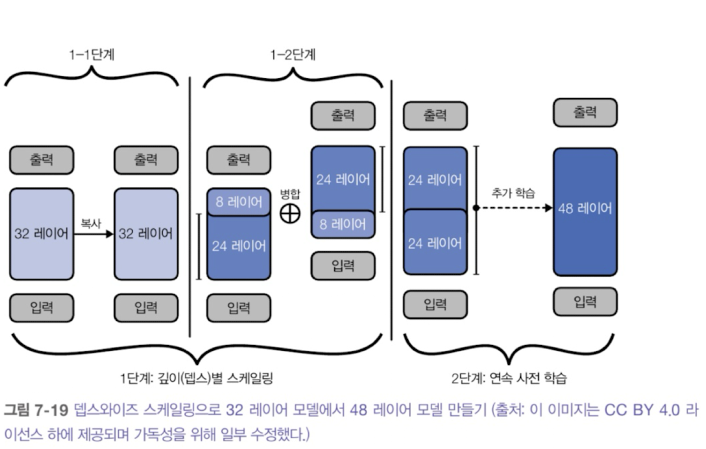
        
        <aside>
        
        1. 원래 사전학습된 모델을 복사한다.
        2. 두 복사본을 병합하는데, 일부 레이어는 합치고(두 레이어를 더해서 하나로 만들기) 나머지는 그냥 쌓는다. 어떤 레이어를 합칠지는 목표 모델 크기에 맞춰서 신중하게 정한다. (Solar 10.7B는 16개 레이어를 합쳐서 최종적으로 32 x 2 -16 = 48개 레이어가 되도록 했다.)
        3. 이렇게 확장된 모델을 목표 성능에 도달할 때 까지 추가로 학습시킨다.
        </aside>
        
- 연결
    - 구성 모델의 파라미터를 다양한 방식으로 더하는 대신,
        
        그냥 연결하는 방법도 있다. 병합된 구성 요소의 파라미터 개수는 모든 구성 요소의 파라미터를 다 합친 것과 같다. 
        (랭크가 r1, r2인 LoRA 어댑터 2개를 병합하면, 병합된 어댑터의 랭크는 r1 + r2가 될 것 이다.)
        
        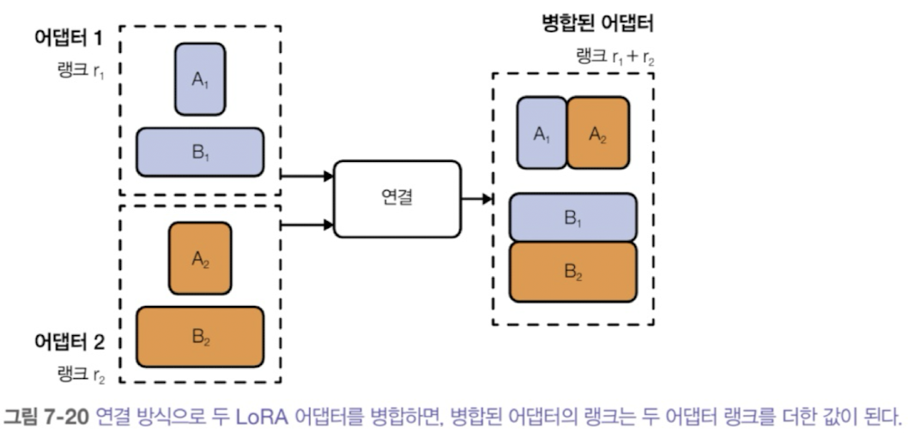
        
    - 따로 서빙하는 것과 비교해서 메모리 사용량이 전혀 줄어들지 않기 때문에 별로 추천하지 않는다.
    - 연결 방식으로 성능이 좋아질 수 있지만, 늘어나는 파라미터 수를 생각하면 성능 향상이 큰 가치가 없을 수 있음

### 7.4.3 파인튜닝 전술

### 파인튜닝 프레임워크와 기본 모델

> 파인튜닝을 할지 말지 정하고, 데이터를 확보하고, 파인튜닝된 모델을 유지 및 관리하는 것은 쉽지 않지만, 정작 파인튜닝 자체는 그리 복잡하지 않다. 
**기본 모델, 파인튜닝 방법, 파인튜닝 프레임워크를 결정하면 된다.**
> 

### 기본모델

- 모델 선택 기준: 모델 크기, 라이선스, 벤치마크 성능 / 예산 내 가장 좋은 모델로 시작하는 것을 추천

<aside>

< OpenAI의 파인튜닝 모범 사례 >

- 진행 경로(Progression path)
    - 가장 저렴하고 빠른 모델로 파인튜닝 코드를 테스트해서 코드가 예상대로 작동하는지 확인
    - 가지고 있는 데이터를 확인해보기 위해, 중간급 모델을 파인튜닝
    파인튜닝에 사용되는 데이터를 늘림에 따라 학습 손실이 떨어지지 않으면 뭔가 잘못된 것
    - 최고로 성능이 좋은 모델로 몇 가지 실험을 더 돌려서 성능을 어디까지 끌어올릴 수 있는지 확인
    - 좋은 결과가 나오면 모든 모델로 학습을 진행해서 비용 대비 성능 현황을 파악하고, 활용 사례에 가장 적합한 모델을 선택한다.
- 증류 경로(Distillation path)
    - 작은 데이터셋과 감당할 수 있는 가장 강력한 모델부터 시작한다. 작은 데이터셋으로 가능한 최고의 모델을 학습시킨다. 기본 모델이 이미 강력하기 때문에, 좋은 성능을 달성하기 위해 소량의 데이터만 필요하다.
    - 이 파인튜닝된 모델을 사용해서 더 많은 학습 데이터를 생성한다.
    - 이 새로운 데이터셋으로 더 저렴한 모델을 학습시킨다.
</aside>

### 파인튜닝 방법

- LoRA 등의 어댑터 기법은 비용 효율적이지만 Full 파인튜닝만큼 성능이 나오지 않는다.
- 어떤 파인튜닝 방법을 사용할지는 데이터 양에 따라서도 달라진다. 기본 모델과 작업에 따라 다르긴 하지만, Full 파인튜닝은 보통 최소 수천 개의 예시가 필요하고, 대개는 훨씬 더 많이 필요하다
- PEFT 방법들은 훨씬 적은 데이터로도 괜찮은 성능을 낼 수 있다. 수백개 정도의 작은 데이터셋이면 Full 파인튜닝보다 좋은 성능을 보일 수도 있음
- 파인튜닝 된 모델이 몇개나 필요한지, 어떻게 서빙하고 싶은지도 고려 요소
    - LoRA: 전체 모델 하나만 서빙 ↔ Full 파인튜닝: 전체 모델을 여러 개 서빙

### 파인튜닝 프레임워크

- **파인튜닝 API**를 사용하는 것이 가장 쉬운 방법(데이터 올리고, 기본 모델 선택하면 파인튜닝된 모델을 받을 수 있다.)
- 파인튜닝 프레임워크를 통해 다양한 파인튜닝 방법(특히, 어댑터 기반 방법)을 사용할 수 있다.
    - LlaMA-Factory, unsloth, PEFT, Axolotl, LitGPT
    - 직접 파인튜닝을 하면 더 많은 유연성을 얻을 수 있지만, 필요한 컴퓨팅 자원을 직접 준비해야한다.
    - 여러 머신(GPU)로 모델을 파인튜닝하려면, 딥스피드, Pytorch Distributed, ColossalAI 같은 분산 학습 지원 프레임워크가 필요하다.

### 파인튜닝 하이퍼파라미터

- 학습률
    - 각 학습 단계에서 모델 파라미터가 얼마나 빨리 변할지를 정한다.
    - 1e-7 ~ 1e-3 사이에서 여러 학습률을 시도
    - 사전 학습 단계 끝에서 사용한 학습률에 0.1 ~ 1 사이의 값을 곱하는 것
    - **손실 곡선이**
        - 심하게 변동된다면, 학습률이 너무 큰 것
        - 안정적이지만 떨어지는 데 너무 오래 걸린다면, 학습슐이 너무 작은 것
- 배치 크기
    - 모델의 가중치를 업데이트할 때, 각 단계에서 몇 개의 예시로 학습할지를 결정
    - 너무 작으면, 학습이 불안정해질 수 있다.(이유는 명확하게 설명하기 어려움)
    - 보통 배치 크기가 클수록 모델이 학습 예시들을 더 빠르게 처리할 수 있다. 하지만, 배치 크기가 클수록 모델을 실행하는 데 더 많은 메모리가 필요하다(배치 크기는 사용하는 하드웨어에 따라 제한)
        
        →배치마다 모델 가중치를 업데이트하는 대신, 여러 배치에 걸쳐 그래디언트를 모아뒀다가 충분히 신뢰할 수 있는 그래디언트가 쌓이면 그때 모델 가중치를 업데이트[그래디언트 누적: Gradient accumulation]
        
- 에폭 수
    - 학습 데이터를 한 바퀴 다 도는 것
    - 학습 손실과 검증 손실의 차이를 보면 에폭 수를 결정하는 데 힌트를 얻을 수 있다
        - 둘 다 꾸준히 감소한다면, 에폭 수를 늘려서 학습하면 성능이 개선될 수 있다.
        - 학습 손실만 감소한다면, 과적합이므로 에폭 수를 줄여보는 게 좋다.
- 프롬프트 손실 가중치
    - 프롬프트와 응답으로 구성되며, 학습 과정에서는 프롬프트와 응답 모두 모델 손실에 영향을 줄 수 있다.
    - 프롬프트 모델 가중치는 응답에 비해 프롬프트가 손실 계산에 얼마나 반영될지를 결정한다.